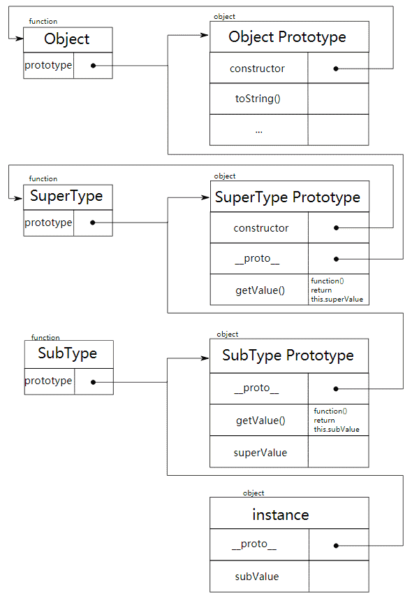
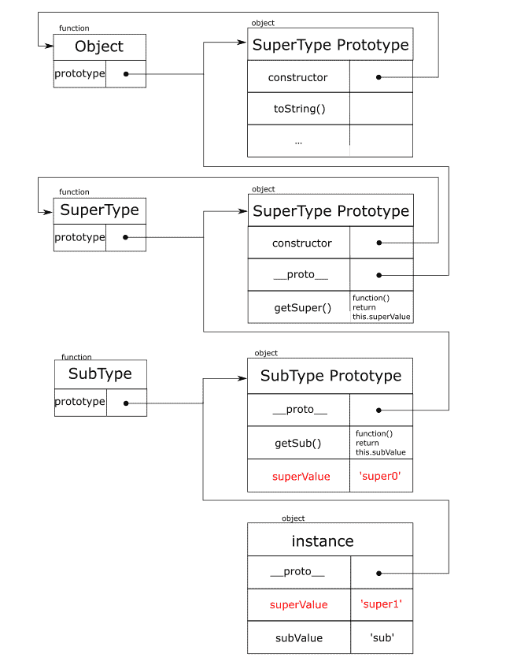
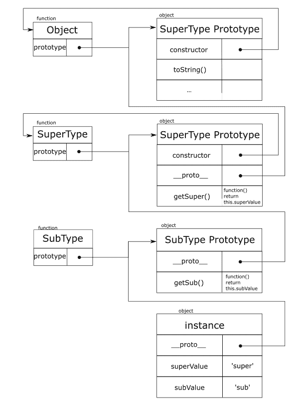
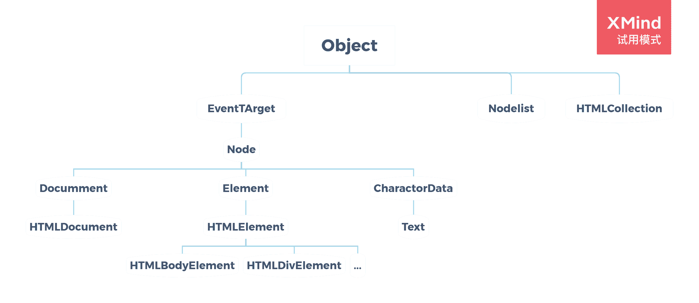

<h1>JavaScript基础</h1>

本文为《JavaScript高级程序设计》（第3版）前14章的笔记，没有全部摘录，不是关于JavaScript的教程，如果您对JavaScript不熟悉，强烈建议您阅读《JavaScript高级程序设计》（第3版），该书对ES5标准的JavaScript有既详实又易懂的介绍。在经过几次面试后，深感自己的JavaScript基础知识不是很好，所以又重新读了这本书的前14章，并把其中的有利于理解JavaScript的基础概念（如**原型链**、事件流），以及一些我觉得有价值的知识点整理了一下，在其上做了些补充。另外，如本文和ES6有冲突，以ES6为准。

<!--more-->

## 基本概念

1. 函数内var定义的数据，在函数外无法访问。
   ```javascript
   (function() {
       var test = 1;
   })()
   console.log(test);//错误
   ```
2. 在全局作用域直接定义的变量是全局变量；省略var操作符，直接使用的变量是全局变量。
   ```javascript
   var test1 = 1;
   (function() {
       test2 = 2;
   })()
   console.log(window.test1 === test1);//true
   console.log(window.test2 === test2);//true
   ```
3. ECMAScript有5中基本数据类型，分别是`Undefined` `Null` `Boolean` `String` `Number`。
   
4. `typeof null === 'object'`，typeof共有6种结果，分别是`'undefined'` `'boolean'` `'string'` `'number'` `'object'` `'function'`。
   
5. 不需要显式指定`undefined`值，仅用作比较；未声明和未初始化的变量都是`undefined`。
   
6. 一些默认的转换函数：`Boolean()` `Number()`  `String()`，推荐使用这些函数转换类型。
   
7. `parseInt(string, n)`和`number.toString(n)`函数中的n(2,8,10,16)可以设置**字符串指代数字**的进制，比如下面第一行就是指11是一个16进制数字的字符串，第二行就是指转换后的字符串所代表数字为16进制。
    ```javascript
    parseInt('11', 16);//17
    11.toString(16);//'b'
    ```

8. 按位非`~`，按位与`&`，按位或`|`，按位异或`^`，左移`<<`，有符号右移`>>`，无符号右移`>>>`。
   
9. `&&`和`||`是短路操作符。
    
10. 存在字符串时，把数字运算括起来。
    ```javascript
    var message = '1 + 2 = ' + (1 + 2);//'1 + 2 = 3'。
    ```

11. 在使用`>` `<` `>=` `<=` `==`操作符比较时，除`null`和`undefined`外：若两个基本值类型不同，总是将两者转换为数字进行比较；若一个值为引用类型，则使用String()函数将其转换成字符串后再比较。
    ```javascript
    true < 2;//true
    '0' == false;//true
    [11] == 0xb;//true
    var a = {a:1};
    a == '[object Object]';//true
    ```

12. `undefined == null`，且和其他值比较时不进行类型转换，所以均为`false`，虽然`isNaN(Number(undefined)) === true` `Number(null) === 0`。
    
13. 模赋值`%=`，有符号左移赋值`<<=`，有符号右移赋值`>>=`，无符号右移赋值`>>>=`。

14. `for`循环和`for-of`能用于可迭代的数据类型，如字符串（的基本包装类型）和数组；   
    `for-in`能用于对象（包括数组）和字符串。

15. label语句可以和break或continue语句联合使用。
    ```javascript
    var num = 0;
    here:
    for(var i = 0; i < 10; i++) {
        for(var j = 0; j < 10; j++) {
            if(i === 5 && j === 5) break here;
            num++;
        }
    }
    console.log(num);//55
    ```

16. arguments和命名参数的值保持同步。
    ```javascript
    (function (a) {
        arguments[0] = 1;
        console.log(a);
    })(0)//1
    ```

17. ECMAScript没有函数重载，但可以根据参数做出不同的反应，模仿函数重载。

## 引用类型

1. 检测引用类型时使用`instanceof`，该操作符可确认某对象的所有构造函数（这里的构造函数指，只要其prototype指向该对象的原型链上某个对象，那就算该对象的广义上的构造函数）。

2. Array实例的一些方法：
    ```javascript
    [1, 2, 3].join();//"1,2,3"
    [1, 2, 3].join('|');//"1|2|3"
    [1, 2, 3].reverse();//[3, 2, 1], 数组本身会变
    [1, 3, 2].sort(function(a, b) {return a > b ? 1 : -1});//[1, 2, 3], 需要排列则返回1, 否则返回-1, 数组本身会变
    [1, 2, 3].lastIndexOf(0);//3
    [1, 2, 3].reduce(function(pre, cur) {return pre + cur;});//6
    [{x : 1}, {x: 2}].reduce(function(pre, cur) {return pre + cur.x;}, 0);//3, 0为初始值
    [[1, 2], [3, 4]].reduce(function(pre, cur) {return pre.concat(cur);});//[1, 2, 3, 4]
    ```
3. 使用Date创建日期对象时，若不想使用当前时间，而是使用指定时间，可使用以下命令：
    ```javascript
    var allFives = new Date(2015, 4, 5, 17, 55, 55);//2015年5月5日下午5点55分55秒
    ```

4. 使用RegExp构造函数创建正则表达式时，需要对字符串双重转义，RegExp使用的是字符串的输出值（console.log()），并不清楚字符串内部细节，
   所以字符串实际的输出值需要和字面量模式下保持一致。
    ```javascript
    var reg00 = /\[error\]/;
    var reg01 = new RegExp('\\[error\\]');//上面两个正则表达式相同，匹配"[error]"字符串
    var reg10 = /\\n/g;
    var reg11 = new RegExp('\\\\n', 'g');//上面两个正则表达式相同，并不是匹配换行符，而是全局匹配"\n"这样的字符
    ```

5. RegExp实例的方法exec：在正则表达式不设全局标志时，该方法只会不断返回第一个匹配项；在正则表达式设置全局标志时，对于相同的字符串，该方法
   会依次返回匹配的字符串，最后返回null；   
   RegExp实例的方法test：符合返回true，不符合返回false。
    ```javascript
    var pattern = /.at/g;
    var str1 = str2 = 'cat, rat';
    pattern.exec(str1);//{0: 'cat', index: 0}
    pattern.exec(str2);//{0: 'rat', index: 5}
    pattern.exec(str1);//null
    pattern.exec(str2);//{0: 'cat', index: 0}
    pattern.test('cat');//true
    pattern.test('dog');//false
    ```

6. Function实例的方法apply，call，bind：扩充函数作用域。
    ```javascript
    var obj = {a: 'chosen a', b: 'chosen b'};
    function show (choice) { console.log(this[choice]) }
    show.apply(obj, ['a']);//chosen a
    show.call(obj, 'b');//chosen b
    function log (msg) { this.log(msg) }
    log = log.bind(console);
    log('hello bind');//hello bind
    ```

7.  Number实例的一些方法:
    ```js
    var num = 10;
    num.toFixed(2);//10.00
    num.toExponential();//1e+1
    
    ```

8. String实例和String构造函数的一些方法：
    ```javascript
    var str = 'hello world!';
    str.charAt(1);//e
    str.charCodeAt(1);//101
    str.match(/.o/g);//['lo', 'wo']
    str.search(/.o/g);//3
    String.fromCharCode(104, 101, 108, 108, 111);//hello
    ```

## 面向对象的程序设计

1. 对象有两种属性: 数据属性和访问器属性.

   直接定义的属性都是数据属性, 数据属性有4个描述其行为的特性:
   - Configurable, 能否通过`delete`删除属性, 能否修改Configurale和Enumerable, 能否修改Writable为`true`, 能否将属性变更为访问器属性
   - Enumerable, 能否通过for-in访问到属性
   - Writable, 能否更改属性的值
   - Value, 属性的值
    直接定义的属性前三个特性值都为`true`, Value为指定的值或`undefined`. 除了直接定义, 我们还可以通过`Object.defineProperty`来定义和修改对象的数据属性. 例子如下:
    ```js
    var obj;
    Object.defineProperty(obj, 'name', {
        value: 'value',
        enumerable: `true`
    })
    ```
    前三个特性值不指定均默认为`false`, 即该数据属性不可删除, 不可枚举, 也不可修改属性值, Configurale和Enumerable也不能修改, Writable不能由`false`修改为`true`.

    访问器属性不包括Value, 它包括以下4个描述其行为的特性:
    - Configurable, 能否通过`delete`删除属性, 能否修改属性的4个特性, 能否将属性变更为访问器属性
    - Enumerable, 能否通过for-in访问到属性
    - Set, 在写入时调用的函数
    - Get, 在读取时调用的函数
    访问器属性不能直接定义, 需要通过`Object.defineProperty`来定义和修改对象的访问器属性, 指定Get或Set即为设置访问器属性. 例子如下:
    ```js
    var obj = {_a: 1};
    Object.defineProperty(obj, 'name', {
        configurable: true,
        enumerable: true,
        set: function (v) {
            this._a = v;
        },
        get: function () {
            return this._a;
        }
    })
    ```

    可以通过`Object.defineProperties`定义多个属性.
    ```js
    Object.defineProperties(obj, {
        'name1': {},
        'name2': {}
    })
    ```

    可以通过`Object.getOwnPropertyDescriptor(obj, 'name')`来读取属性的特性.

2. 按照构造函数模式创建对象：
    ```javascript
    function Person () {
        this.name = 'Sam';
    }
    var person = new Person();
    //等同于
    var person = {};
    function Person () {
        this.name = 'Sam';
    }
    Person.call(person);
    //构造函数的实际过程
    ```

3. 按照原型模式创建对象：
    ```javascript
    function Person () {}
    Person.prototype.name = ['Sam'];
    var person0 = new Person();
    var person1 = new Person();
    person0.name === person1.name;//true
    ```

4. 按照构造函数模式创建对象的好处是可以标识，按照原型模式创建对象的好处是可以共享。   
   可以组合利用两种模式，利用构造函数模式定义特有属性，利用原型模式定义方法和共享属性。
    ```javascript
    function Person (name) {
        this.name = name;
    }
    Person.prototype.sayName = function () {console.log(this.name);}
    Person.prototype.sayAge = function () {console.log(this.age);}
    Person.prototype.age = 20;
    var person0 = new Person('Sam');
    var person1 = new Person('Amy');
    with(person0) {sayName(); sayAge()};//Sam, 20
    with(person1) {sayName(); sayAge()};//Amy, 20
    ```

5. 以下代码中，构造函数、原型和实例的关系如图：
    ```javascript
    function SuperType () {
        this.superValue = 'super';
    }
    function SubType () {
        this.subValue = 'sub';
    }
    SuperType.prototype.getValue = function () {
        return this.superValue;
    }
    SubType.prototype = new SuperType();
    SubType.prototype.getValue = function () {
        return this.subValue;
    }
    var instance = new SubType();
    with(instance) {
        console.log(getValue(), superValue, subValue);
    }//sub super sub
    ```
    

6. 搜索对象属性和方法会按照实例-原型依次向上查找, 直到找到为止, 所以实例中的属性和方法可以屏蔽掉原型中的属性和方法, 如4中的getValue. 为了确定属性和方法的来源, 以及获取所有属性和方法, 可以按照以下表格的思路(Symbol类型是ES6中的新数据类型, 为了总结, 将它的遍历和检测方法一并放到这里):

   遍历方法:
   | 方法 | 自身可迭代属性 | 自身不可迭代属性 | 自身Symbol属性 | 继承可迭代属性 | 继承不可迭代属性 | 继承Symbol属性|
   | :--: | :--: | :--: | :--: | :--: | :--: | :-- |
   | `Object.keys(obj)` | * | | | | |
   | `Object.getOwnPropertyNames(obj)` | * | * | | | |
   | `for(name in obj)` | * | |  | * | |
   | `Object.getOwnPropertySymbols(obj)` | | | * | | |
   | `Reflect.ownKeys(obj)` | * | * | * | | |

   检测方法:
   | 方法 | 自身可迭代属性 | 自身不可迭代属性 | 自身Symbol属性 | 继承可迭代属性 | 继承不可迭代属性 | 继承Symbol属性|
   | :--: | :--: | :--: | :--: | :--: | :--: | :-- |
   | `obj.hasOwnProperty(name)` | * | * | * | | |
   | `name in obj` | * | * | * | * | * | * |

7. 使用原型链进行方法和共享属性的继承，使用构造函数进行一般属性的继承，这就是组合继承。组合继承如下：
    ```javascript
    function SuperType (v) {
        this.superValue = v;
    }
    function SubType (sup, sub) {
        this.subValue = sub;
        SuperType.call(this, sup);//通过构造函数继承一般属性，第2次调用SuperValue
    }
    SuperType.prototype.getSuper = function () {
        return this.superValue;
    }
    SubType.prototype = new SuperType('super0');//通过原型链继承方法和共享属性，第1次调用SuperValue
    SubType.prototype.getSub = function () {
        return this.subValue;
    }
    var instance = new SubType('super1', 'sub');
    with(instance) {
        console.log(getSub(), getSuper());
    }//sub super1
    ```
    构造函数、原型和实例的关系如图：   
    

8.  可以看出，组合继承两次调用SuperValue，使得instance.superValue被定义了两次，发生了重复。我们的原则是一般的属性不应该进入原型链，共享属性和方法进入原型链，实现真正的共享属性和方法通过原型链继承，一般属性通过构造函数继承，寄生组合继承是最终的解决方案。
    ```javascript
    function inheritPrototype (prototype) {
        function F () {}
        F.prototype = prototype;
        return new F();
    }
    function SuperType (v) {
        this.superValue = v;
    }
    function SubType (sup, sub) {
        this.subValue = sub;
        SuperType.call(this, sup);//通过构造函数继承一般属性
    }
    SuperType.prototype.getSuper = function () {
        return this.superValue;
    }
    SubType.prototype = inheritPrototype(SuperType.prototype);//通过原型链继承方法和共享属性
    SubType.prototype.getSub = function () {
        return this.subValue;
    }
    var instance = new SubType('super', 'sub');
    with(instance) {
        console.log(getSub(), getSuper());
    }//sub super
    ```
    

## 函数表达式

1. 函数声明有一个重要的特征，就是函数声明提升，意思是在代码执行之前读取函数声明。函数表达式没有这一点，它只是一个普通的Function类型的实例。
    ```javascript
    show();//hello
    function() {
        console.log('hello');
    }
    ```
    ```javascript
    //不要这样使用
    if(true) function f () {}
    else function f () {}
    ```
    ```javascript
    //可以这样使用
    if(true) f = function () {}
    else f = function () {}
    ```
2. 为了防止函数名字发生改变而影响递归的使用，可以使用命名函数表达式，以下代码利用递归实现了阶乘：
    ```javascript
    var factorial = function f (n) {
        return n <= 1 ? 1 : n * f(n - 1);
    }
    factorial(4);//24
    f;//undefined，在外部不会访问到f这个变量
    ```

3.  关于this的指代, 两句话:
    - 普通函数this指向函数的调用者, 如obj.fun()指向obj, fun()指向globalThis, fun.apply(obj)指向obj
    - 箭头函数始终指向函数定义函数时所在的对象
    匿名函数的话, 调用者是globalThis, 所以this指向globalThis. 下面是例子:
    ```js
    let fun = function () {
        console.log(this)
    }
    let obj = {
        fun0: fun,
        fun1() {
            fun()
        },
        fun2() {
            (() => {
                console.log(this)
            })()
        }
    };
    obj.fun0();//obj
    obj.fun1();//Window
    obj.fun2();//obj
    ```
    *此部分参考了<https://juejin.im/post/6844903511868571656>*

4. JavaScript没有块级作用域概念，可以使用函数来模拟：
    ```javascript
    (function () {

    })();
    ```

## BOM

1. 在浏览器中，`window`具有双重角色，它既是JavaScript访问窗口的一个接口，又是Global对象。
   
2. 跨frame的instanceof操作符不管用，因为`top.Object != top.frames[0].Object`。
   
3. `window.screenLeft`和`window.screenTop`分别表示**浏览器窗口相对于屏幕**左边缘和上边缘的位置。这两个值受操作系统缩放比例的影响。   
   `window.outerWidth`和`window.outerHeight`分别表示**浏览器窗口**的宽度和高度，这两个值受操作系统缩放比例的影响。   
   `window.innerWidth`和`window.innerHeight`分别表示**包含滚动条的内部窗口**宽度和高度，这两个值受操作系统缩放比例和浏览器缩放比例的影响。   
   html元素的`clientWidth`和`clientHeight`分别表示**不包含滚动条的内部窗口**宽度和高度，这两个值受操作系统缩放比例和浏览器缩放比例的影响。  
   `window.devicePixelRatio`表示物理像素分辨率和CSS像素分辨率之比，即显示效果的放大倍数。
   ```javascript
    // Windows操作系统的缩放比例是1.24，浏览器的缩放比例是1.25
    // 在浏览器最大化时
    // 显示器分辨率为1920*1080
    window.screenLeft;//0
    1920 / window.outerWidth;//约1.24
    window.outerWidth / window.innerWidth;//约1.25
    window.innerWidth - document.documentElement.clientWidth;//13，指上下滚动条的CSS像素宽度为13
    window.devicePixelRatio;//约1.55，即1.24*1.25
   ```
    在手机上, 当用户未进行系统缩放时, n倍屏中的n就是`window.devicePixelRatio`.
   ```javascript
    // iphone SE, 屏幕名义宽度375px, 屏幕实际宽度750px
    window.devicePixelRatio; // 2
    // iphone 13, 屏幕名义宽度390px, 屏幕实际宽度1170px
    window.devicePixelRatio; // 3
    // samsung s20, 屏幕名义宽度360px, 屏幕实际宽度1440px
    window.deviecPixelRatio; // 4
   ```

4. 打开新标签页：`window.open(url)`，本页面加载其他网址：`window.open(url, '_self')`，弹出窗口：`window.open(url, true)`。

5. 使用`prompt(question, defaultAnswer)`方法可以弹出文本对话框。

6. `location`对象既属于`window`，又属于`document`，也就是说`window.location === document.location`。
   
7. 可以通过修改`location`对象的属性来改变当前页面地址，`location`对象的属性如下：
    | 属性名 | 例子 |
    |:-----:|:----:|
    | hash | `'#contents'` |
    | host | `'www.baidu.com:443'` |
    | hostname | `'www.baidu.com'` |
    | href | `'https://www.baidu.com:443/content'` |
    | pathname | `'/content'` |
    | port | `443` |
    | protocol | `'https:'` |
    | search | `'?query=abc'` |

8.  重新加载页面：
    ```javascript
    locaiton.reload();//重新加载（有可能从缓存加载）
    location.reload(true);//从服务器重新加载
    ```

10. 如果想让用户不能返回之前的网页，可以使用`location.replace(url)`方法。
    
11. 出于安全考虑，开发者无法获得用户浏览过的url，但是可以在不知道url的情况下使用`window.histiry`对象实现前进和后退：
    ```javascript
    history.go(-1);//后退一页
    history.go(2);//前进两页
    history.go('baidu.com');//跳转到最近的‘baidu.com’页面
    history.length === 0;//这是当前用户打开窗口后的第一个页面
    ```

## DOM

1. 通过一个节点的`nodeType`属性, 可以获得节点的类型, 详情如下:
    | 常量 | 值 | 描述 |
    | :-: | :-: | :-: |
    |Node.ELEMENT_NODE|1|元素节点|
    |Node.TEXT_NODE|3|文本节点|
    |Node.COMMENT_NODE|8|注释节点|
    |Node.DOCUMENT_NODE|9|Document节点, 一般是html节点和DOCTYPE节点的父节点|
    |Node.DOCUMENT_TYPE_NODE|10|DOCTYPE节点|
    |Node.DOCUMENT_FRAGMENT_NODE|11|文档片段节点, 虚拟DOM, 不在真实DOM中|

2. NodeList是一组有序的节点，有length属性，可以通过[]访问其值，但是它不是Array的实例。
    ```javascript
    var nodes = Array.prototype.slice.call(aNodeList, 0);//将NodeList转换成数组
    ```

3. Node类型的一些方法：
    ```javascript
    parent.appendChild(newChild);
    parent.insertBefore(newChild, anotherChild);
    parent.replaceChild(newChild, anotherChild);
    parent.removeChild(child);
    ```
4. 使用`document.documentElement`或`document.lastChild`访问\<html\>对象，使用`document.body`访问\<body\>对象，使用`document.head`访问\<head\>对象。

5. 使用`document.createElement()`创建元素节点，使用`document.createTextNode()`创建文本节点，使用`textNode.nodeValue`获得文本节点的文本。
    ```javascript
    var ele = document.createElement('div');
    var txt = document.createTextNode('hello!');
    ele.appendChild(txt);
    document.body.appendChild(ele);
    console.log(document.body.lastElementChild.firstChild.nodeValue);//hello!
    ```

6. `document.querySelector()`和`document.querySelectorAll()`方法均接受一个CSS选择符，分别返回匹配的第一个元素和所有元素的NodeList。

7. 关于Node之间的父子兄弟关系, `parentElement` `children` `firstElementChild` `lastElementChild` `previousElementSibling` `nextElementSibling`系列仅会考虑元素节点, 即nodeValue为1的Node; `parentNode` `childNodes` `firstChild` `lastChild` `previousSibling` `lastSibling`系列会考虑所有类型节点, 包括文本节点, Document节点等.

8. Node的class操作可以不使用`className`，而使用`classList`，`classList`是`DOMTokenList`的实例，有下列方法：
    ```javascript
    ele.classList.add('some-class');
    ele.classList.remove('some-class');
    ele.classList.contains('some-class');
    ele.clsssList.toggle('some-class');
    ```

9.  关于焦点：
    ```javascript
    ele.focus();//使该元素获取焦点
    ele.blur();//使该元素失去焦点
    ele.hasFocus();//测试该元素是否获取了焦点
    document.activeElement;//取得当前获取焦点的元素
    ```

10. 除了\<meta\>外，也可以直接使用`document.charset`设置字符集，该值默认为`'UTF-16'`。
    
11. `ele.outerHTML`会返回包括自身的HTML代码。
    
12. `ele.scrollIntoView()`方法可以使元素置于视口中。

13. DOM继承关系图
    


## 事件

1. JavaScript和HTML之间的交互是通过**事件**实现的，事件的接收顺序叫做事件流。IE的事件流是事件冒泡，即从最具体的节点开始，一直到顶层的document；Netscape的事件流是事件捕获，即从最顶层的document开始，到最具体的那个节点。“DOM2级事件”规定的事件流包括了上述两类，为事件捕获、处于目标阶段和事件冒泡三个阶段。

2. 使用html事件处理程序时 `this`指代当前的节点。不仅如此，在html事件处理程序中，还扩充了作用域，它扩充了`this` `document`作用域，如果这是个表单输入元素（`input`），它还扩充了`this.form`作用域。这样一来，访问节点和节点的属性就可以像访问局部变量一样方便了。
    ```html
    <form method="post">
        <input type="text" name="username" value="sam">
        <input type="button" value="clickme" onclick="console.log(username.value)">
    </form>
    <!-- sam -->
    ```

3. 使用DOM0级事件处理程序时`this`指代当前的节点，且会传入event参数。
   ```javascript
    let btn = document.createElement('button');
    btn.appendChild(document.createTextNode('clickme'));
    document.body.appendChild(btn);
    btn.onclick = function (event) {
        console.log(event.target === this);//true
    }
   ``` 
   > 当然在Vue中，html中的`$event`等同于`event`，如果html中不传参，只写响应函数的名字，会自动传入`$event`；
   > js部分，this最终指代Vue实例，不指代事件发生的元素，所以`this.value` `this.$event`这种访问方式不起作用。

4. 使用DOM2级事件处理程序时`this`指代当前节点，且会传入event参数。函数第3个布尔值为`true`代表在事件捕获阶段接收事件，为`false`代表在事件冒泡阶段接收事件，默认值为`false`。在target节点上，无所谓捕获和冒泡，触发顺序受其注册顺序影响；在非target节点上，当然是先捕获后冒泡。   
此外，添加和移除的handler函数需为同一个函数，即`handlerAdd === handlerRemove`，这样才能有效地移除handler。
    ```javascript
    let btn = document.createElement('button');
    btn.appendChild(document.createTextNode('clickme'));
    document.body.appendChild(btn);
    document.body.addEventListener('click', function () {
        console.log('body click, event bubbling')
    })
    document.body.addEventListener('click', function () {
        console.log('body click, event capturing')
    }, true)
    btn.addEventListener('click', function () {
        console.log('btn click, event bubbling')
    })
    btn.addEventListener('click', function () {
        console.log('btn click, event capturing')
    }, true)
    /*
    body click, event capturing
    btn click, event bubbling
    btn click, event capturing
    body click, event bubbling
    */
    ```

5. 下表为DOM事件对象的一些属性
    | 属性名 | 类型 | 说明 |
    |:-----:|:----:|:----:|
    |detail|Intenger|事件处理的细节信息|
    |eventPhase|Intenger|1捕获2处于目标3冒泡|
    |preventDefault()|Function|取消默认行为|
    |stopPropagation()|Function|阻止事件的进一步冒泡或捕获|
    |target|Element|事件所在元素|
    |type|String|事件触发的类型|

6. 一些典型的事件
    * UI事件（BOM事件）
      * load
      * scroll
      * resize
    * 焦点事件
      * focusin
      * focusout
    * 鼠标事件
      * mousedown
      * mouseup
      * click
      * dblclick
      * mouseover
      * mouseout
      * mousemove
      * mousewheel
    * 键盘事件
      * keydown
      * keypress
      * keyup
    * 触摸事件
      * touchstart
      * touchmove
      * touchend
  
7. 所谓focus和blur不支持冒泡，是指这些事件不会触发“事件冒泡”，但是仍然会触发“处于目标阶段”。下面为使用`addEventListener`方法（DOM2级事件处理程序）监听事件的实例：
    ```javascript
    //DOM中有一个id为'ipt'的input元素
    var i = document.getElementById('ipt');
    var b = document.body;
    i.addEventListener('focus', function () {
        console.log('input focus')
    })
    b.addEventListener('focus', function () {
        console.log('body focus, capture')
    }, true)
    b.addEventListener('focus', function () {
        console.log('body focus, bubbling')
    })
    i.focus();//依次显示 body focus, capture; input focus
    ```
    ```javascript
    //DOM中有一个id为'ipt'的input元素
    var i = document.getElementById('ipt');
    var b = document.body;
    i.addEventListener('focusin', function () {
        console.log('input focus')
    })
    b.addEventListener('focusin', function () {
        console.log('body focusin, capture')
    }, true)
    b.addEventListener('focusin', function () {
        console.log('body focusin, bubbling')
    })
    i.focus();//依次显示 body focusin, capture; input focusin; body focusin, bubbling
    ```
    ```javascript
    //DOM中有一个id为'ipt'的input元素
    var i = document.getElementById('ipt');
    var b = document.body;
    i.addEventListener('mouseover', function () {
        console.log('input mouseover')
    })
    b.addEventListener('mouseover', function () {
        console.log('body mouseover, capture')
    }, true)
    b.addEventListener('mouseover', function () {
        console.log('body mouseover, bubbling')
    })
    //将鼠标从body移至input，依次显示 body mouseover, capture; input mouseover; body mouseover, bubbling
    //将鼠标从input移出至body，依次显示 body mouseover, capture; body mouseover, bubbling
    ```

8. clientX是指点相对于浏览器窗口的位置，pageX是指点相对于页面的位置（如果一个页面特别宽，那这个值的最大值也会很大），screenX是指点相对于屏幕的位置。

## 表单

1. 使用document.forms获得所有表单，这是一个HTMLCollection的实例，可以通过索引值或名称访问到具体的表单。
   
2. 在`type=submit`的input元素或button元素上点击或回车，可以提交表单，提交表单之前会触发form的`submit`事件。但是直接使用`form.submit()`方法提交表单，是不会触发这一事件的。reset功能同理，但是使用`form.reset()`方法重置表单会触发`reset`事件。

3. 通过form.elements访问表单中的字段，既可以通过名字也可以通过索引值访问具体的某个或某些元素。通过索引值访问到的一定是单个元素，通过名字访问到的有可能是单个元素，也有可能是多个同名的Nodelist。

4. input和textarea文本框都支持`select()`方法，该方法可以选中文本框中的所有文本。无论是用户选择了文本，还是调用`select()`方法选择了文本，都会触发`select`事件。用户选择的部分，可以使用`selectionStart`和`selectionEnd`来获得。如果想通过代码选择部分文本，可以使用`setSelectionRange(start, end)`方法。

5. 剪贴板事件主要有`copy` `cut` `paste`，Chrome、Safari和Firefox都**只能在处理剪贴板事件时**才能访问和设置剪贴板内容，如下所示：
    ```javascript
    document.oncopy = function (e) {
        e.clipboardData.setData('text/plain', 'text you copied');//无论用户复制什么，剪贴板内容不变
    }
    document.oncut = function (e) {
        e.clipboardData.clearData();//无论用户剪切什么，剪贴板都为空
    }
    document.onpaste = function (e) {
        e.clipboardData.getData('text/plain');//获取剪贴板内容
    }
    ```

6. 使用`selectbox.options[n].text`和`selectbox.options[n].value`获取选择框（select）选项的文本和值，使用`selectbox.appendChild(new Option(text, value))`添加选项。