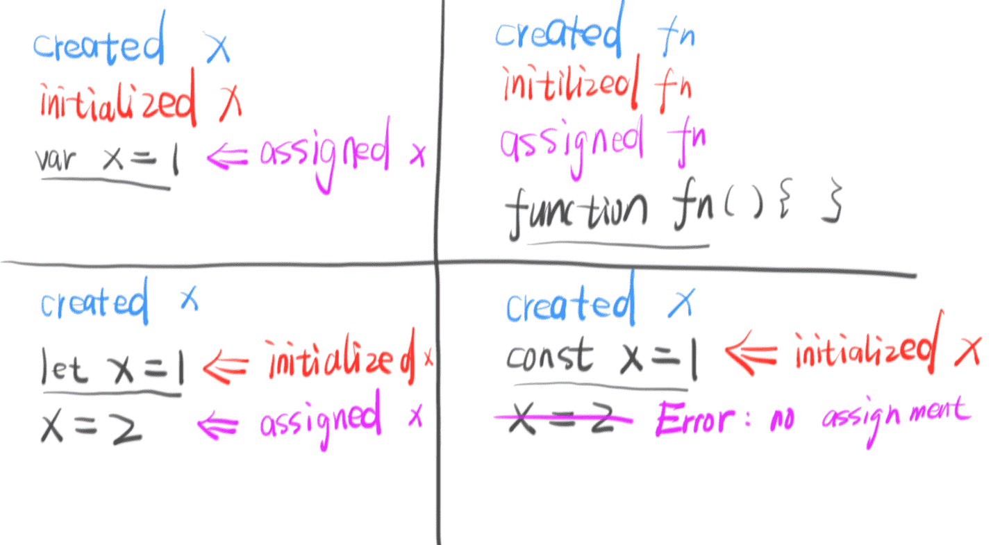
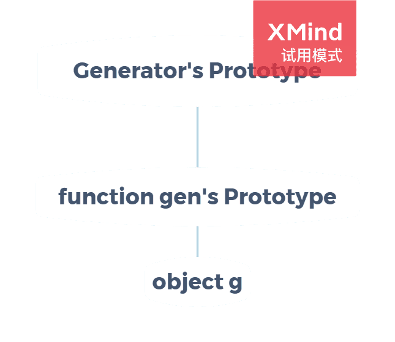
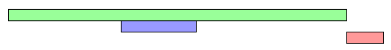

<h1>部分ES6知识</h1>

本文包含ES6(ES2015~ES2020)的let&const, 解构赋值, Symbol, 异步操作和Modlue部分, 是阅读[ECMAScript6入门教程(阮一峰)](https://es6.ruanyifeng.com/)记下的笔记, 记录下了一些我认为有价值的知识, 并不是ES6的教程.

<!--more-->

## let和const

1. `let`的出现确定了块级作用域, 若块级作用域A内函数B访问局部变量, 那么该函数B的作用域链包含块级作用域A, B函数类似于闭包. 下面的例子中, for循环父作用域中嵌套了5个子作用域, 每个作用域内i值不同, 所以每个函数中i值也不同. 如过使用var, 也想达到这样的效果, 就要使用闭包了. 
    ```javascript
    let a = [];
    for(let i = 0; i < 5; i++) {
        a[i] = function () {
            console.log(i)
        }
    }
    a[0]();//0
    ```

2. `let`不像var和function那样存在变量提升, 但是存在“暂时性死区”, 即在一个作用域内, 只要使用`let`声明了变量, 那在声明之前变量是不能使用的.   
其实实际的区别如下图, 图片来自<https://zhuanlan.zhihu.com/p/28140450>
    
    ```javascript
    //var的声明提升
    console.log(a);//undefined
    typeof a;//undefined
    var a = 1;
    //function的声明提升
    b();//2
    typeof b;//function
    function b () {console.log(2)}
    //let的暂时性死区
    console.log(c);//ReferenceError
    typeof c;//ReferenceError
    let c = 3;
    //测试未声明变量
    console.log(d);//ReferenceError
    typeof d;//undefined
    ```

1. 由于环境导致的差异太大, 所以优先使用`let`和函数表达式, 避免在块级作用域内使用函数声明和`var`. 

2. 块级作用域必须有大括号, 没有的话就不能使用`let`. 
    ```javascript
    if(true) var a = 1;//没问题
    if(true) let b = 2;//SyntaxError
    ```

3. 和`let`一样, `const`不允许重复声明, 也存在暂时性死区. 

4. 由于浏览器的顶层对象是`window`/`self`, Node.js的顶层对象是`global`；在全局环境中`this`返回顶层对象, 但是Node.js模块和ES6模块中`this`指当前模块；非对象函数的`this`指向顶层对象, 但是严格模式下指向`udefined`. 所以顶层对象获取比较复杂. ES2020规定了`globalThis`作为顶层对象, 使顶层对象的获取更加方便. 

## 解构赋值

1. 如果等号右边是可遍历的结构, 就可以使用数组的解构赋值. 数组的解构赋值是按次序, 由位置决定赋值的. 
    ```javascript
    let [, , [a], b] = [1, 2, [3, 4]];//a: 3, b: undefined
    let [c, ...d] = [1, 2, 3];//c: 1, d: [2, 3]
    let [e] = null;//TypeError
    ```

2. 数组解构赋值可以设置默认值：
    ```javascript
    let [a = 1, b = a] = [undefined];//a: 1, b: 1
    ```

3. 如果等号右边的值是对象或可以转换成对象, 就可以使用对象的解构赋值. 对象的解构赋值是按照相同属性名赋值的. 
    ```javascript
    let {a, a: {b: c}, d} = {a: {b: 1}, d: 2};//a: {b: 1}, b: undefined, c: 1, d: 2
    let {sin, cos, tan} = Math; let {log} = console;
    let {0: e} = [1, 2];//e: 1, 数组是对象, 所以可以这样使用
    ```

4. '对象解构赋值可以设置默认值：
    ```javascript
    let {a : b = 1} = {};//a: undefined, b: 1
    ```

5. 对于已经声明的变量, 赋值时不要将大括号写在行首, 必要时把赋值语句用括号括起来：
    ```javascript
    let a;
    ({a} = {a: 1});
    ```

6. 字符串可以转换成String类型的对象, 所以也可以使用解构赋值：
    ```javascript
    let [a, b, c] = 'es6';//a: 'e', b: 's', c: '6'
    let {0: d, length: l} = 'es6';//d: 'e', l: 3
    ```

7. 函数参数的结构赋值：
    ```javascript
    let fun = function ({a: c = 1, b = 2} = {a: 3, b: 4}) {
        console.log(c, b);
    }
    fun({a: 5, b: 6});//5 6
    fun({a: 5});//5 2
    fun();//3 4
    ```

## Symbol

1. 在ES6中, Symbol类型是一种基本数据类型, 表示独一无二的值. Symbol类型不能和其他类型运算, 但是可以转换成字符串和布尔值. 
    ```javascript
    let s0 = Symbol();
    let s1 = Symbol('s');
    s0 + 1;//TypeError
    s1 + '1';//TypeError
    String(s0);//'Symbol()'
    String(s1);//'Symbol(s)'
    Boolean(s0);//true
    Boolean(s1);//true
    s0.description;//undefined
    s1.description;//'s'
    ```

2. 将Symbol类型用作对象属性名, 并且遍历：
    ```javascript
    const COLOR_GREEN = Symbol();
    const COLOR_RED = Symbol();
    let obj = {
        [COLOR_GREEN]: '#0f0',
        [COLOR_RED]: '#f00',
        blue: '#00f'
    };
    Object.keys(obj);//['blue']
    Object.getOwnPropertySymbols(obj);//[Symbol(), Symbol()]
    Reflect.ownkeys(obj);//['blue', Symbol(), Symbol()]
    ```

3. 使用`Symbol.for()`方法, 可以在全局环境下, 用字符串对Symbol类型变量进行登记. 使用`Symbol.keyfor()`方法, 可以获得已在全局登记的Symbol类型变量的标识值. 
    ```javascript
    let s0;
    {
        s0 = Symbol.for('s');
    }
    let s1 = Symnol.for('s');
    s0 === s1;//true
    Symbol.keyfor(s0);//'s'

    let s2 = Symbol('s');
    let s3 = Symbol('s');
    s2 === s3;//false
    s0 === s2;//false
    Symbol.keyfor(s2);//ndefined
    ```

4. ES6提供了11个内置的Symbol值, 指向语言内部使用的方法, 这里以`Symbol.replace`为例介绍：
    ```javascript
    //str.replace(from, to) 等同于 from[Symbol.replace](str, to)
    let x = {};
    x[Symbol.replace] = (...s) => console.log(s);
    '123'.replace(x, '456');//['123', '456']
    ```

## Promise

1. Promise是异步编程的一种解决方案, 一个Promise对象代表一个异步操作, 它有3种状态：`pending(进行中)` `fufilled(已成功)` `rejected(已失败)`, 后面两种统称为`resolved(已定型)`, 但是一般我们用`resolved(已定型)`代表`fufilled(已成功)`.

    在详述Promise之前, 需要明确`事件循环(Event Loop)`. `事件循环(Event Loop)`在浏览器和Node.js中的实现是有一些不同的, 参考[这里](https://sien75.github.io/blog/2020/08/31/%E6%B5%8F%E8%A7%88%E5%99%A8%E5%9F%BA%E7%A1%80/#%E5%A4%9A%E7%BA%BF%E7%A8%8B)来了解浏览器的实现, 参考[这里](https://sien75.github.io/blog/2020/09/08/Node-js%E5%9F%BA%E7%A1%80/#%E4%BA%8B%E4%BB%B6%E5%BE%AA%E7%8E%AF-Event-Loop)来了解Node.js的实现.
   
2.  Promise新建后会立即执行, 其`then`方法会按照`Event Loop`执行.Promise对象的`then`方法接受2个参数, 第一个会在Promise对象的`fufilled`状态时执行, 第二个会在其`rejected`状态时执行. 不过不建议这种写法, 一般`then`处理`fufilled`状态, `catch`处理`rejected`状态.

    在下面的代码中, p2会返回一个Promise对象, 所以其状态失效, 改为由p1决定. 所以, 代码执行后的第3秒, 会显示"Error: fail". 错误会沿着异步操作链, 直到被第一个`catch`捕获. 如果没有`catch`捕获, 那该错误会成为未捕获错误, 但不会中断程序执行. 
    ```javascript
    const p1 = new Promise(function (resolve, reject) {
        setTimeout(() => reject(new Error('fail')), 3000)
    })

    const p2 = new Promise(function (resolve, reject) {
        setTimeout(() => resolve(p1), 1000)
    })

    p2.then(result => console.log(result))
    .catch(error => console.log(error))
    // Error: fail
    ```

3. `Promise.prototype.finally()`方法, 不管异步操作最后抛出什么状态, 都会执行该函数回调函数内的操作, 并最终返回一个Promise对象. 如果前一个Promise对象有resolve值, 该Promise对象也有相应的resolve值; 如果前一个Promise对象有reject值, 那该Promise对象也有相应的reject值. 
    ```javascript
    Promise.resolve(2).then(v => {
        return v;
    }).finally(() => {
    }).then(v => {
        console.log(v)
    })
    //2
    ```

4. `Promise.all`方法用于将多个Promise对象合为一个新对象. 只有所有的对象都变为`fufilled`状态时, 新对象才会变为`fufilled`状态; 当其中一个对象状态变为`rejected`状态时, 新对象会变为`rejected`状态. 如果传入参数不是Promise对象, 会使用`Promise.resolve()`将其转换为Promise对象. (下面的例子中, p0, p1, p3状态都是`fufilled`, p2状态是`rejected`.)
    ```javascript
    let p0 = Promise.resolve(0);
    let p1 = Promise.resolve(1);
    let p2 = Promise.reject(2);
    let p3 = Promise.reject(3).catch(e => e);
    Promise.all([p0, p1])
    .then(console.log).catch(console.error);//[0, 1], 第一个显示
    Promise.all([p0, p2])
    .then(console.log).catch(console.error);//2, 第三个显示
    Promise.all([p0, p3])
    .then(console.log).catch(console.error);//[0, 1], 第二个显示
    ```

5. `Promise.race()`方法用于将多个Promise对象合为一个新对象. 只要其中有一个对象的状态改变了, 新对象就跟着改变. 如果传入参数不是Promise对象, 会使用`Promise.resolve()`将其转换为Promise对象. 该方法可以用于下面的设置最大延迟时间的操作:
    ```javascript
    const p = Promise.race([
        fetch('/resource-that-may-take-a-while'),
        new Promise(function (resolve, reject) {
            setTimeout(() => reject(new Error('request timeout')), 5000)
        })
    ]);
    p
    .then(console.log)
    .catch(console.error);
    ```

6. `Promise.allSettled()`方法用于将多个Promise对象合为一个新对象. 只有其中所有对象的状态改变了, 新对象才跟着改变. 如果传入参数不是Promise对象, 会使用`Promise.resolve()`将其转换为Promise对象. 不关心异步操作结果, 只关心这些操作有没有结束, 就可以用这个方法.   
`Promise.any()`方法现在还未纳入标准(2020年), 它用于将多个Promise对象合为一个新对象. 只要有对象都变为`fufilled`状态时, 新对象就会变为`fufilled`状态; 当所有对象状态变为`rejected`状态时, 新对象会变为`rejected`状态. 如果传入参数不是Promise对象, 会使用`Promise.resolve()`将其转换为Promise对象. 

7. `Promise.resolve()`用于将现有变量转换为状态为`fufilled`的Promise类型的变量.
    - 如果现有变量是一个Promise变量, 则原样返回
    - 如果现有变量不是Promise变量, 则返回一个resolve值为该变量值的Promise对象
    ```
    Promise.resolve(v);
    //等同于
    new Promise(resolve => resolve(v));
    ```

8. `Promise.reject()`用于将现有变量转换为状态为`rejected`Promise类型的变量.
    - 如果现有变量是一个Promise变量, 则原样返回
    - 如果现有变量不是Promise变量, 则返回一个reject值为该变量值的Promise对象
    ```
    Promise.reject(v);
    //等同于
    new Promise((resolve, reject) => reject(v));
    ```

## Generator函数

1. Generator函数是异步编程的一种解决方案. 调用Generator函数并不会执行函数中的代码, 该函数返回的是一个继承自该函数原型对象的对象, 它们的关系如下图. 我们先定义一个Generator函数:
    ```javascript
    let gen = function* () {
        let a = yield 1;
        let b = yield 2 * a;
        return b;
    };
    ```
    
    使函数内代码执行有以下几种方法(有遍历器接口就可以):
    - 调用`g.next()`方法.每次调用该方法, 函数内代码都会由上次执行的位置开始, 直到遇到yield表达式, 求出值为止. 以上面函数为例, 第一次调用, 会执行`yield 1`表达式, 并且返回这一值. `g.next()`方法内的参数会作为上一次yield表达式的值. 以上面的函数为例, 第二次调用`g.next(3)`, 首先用`3`替代`yield 1`这个表达式, 再把`3`赋给`a`, 再执行`yield 2 * a`表达式, 把结果`6`返回给调用函数, 然后暂停.
        ```javascript
        let g = gen();
        g.next();//{value: 1, done: false}
        g.next(3);//{value: 6, done: false}
        g.next(4);//{value: 4, done: true}
        g.next();//{value: undefined, done: true}
        ```
    - 使用`for...of`循环. 由于`for...of`循环会在yield表达式返回值的`'done'`字段为`true`时就停止, 所以不会包含return语句的值. 
        ```javascript
        for(let v of gen()) {
            console.log(v)
        }
        /*
        1
        NaN
        */
        ```
    - 使用`...`扩展运算符. 效果同`for...of`.
        ```javascript
        console.log(...gen());//1 NaN
        ```
    - 使用`Aray.from()`. 效果同`for...of`.
        ```javascript
        Array.from(gen());//[1, NaN]
        ```
    - 使用解构赋值. 效果同`for...of`.
        ```javascript
        let [x, y] = gen();
        x;//1
        y;//NaN
        ```

2. 如果想让Generator函数返回的遍历器抛出错误, 可以使用`Generator.prototype.throw()`方法. 使用该方法抛出的错误是遍历器的内部错误, 可以在函数内部捕获, 如果函数内部没有捕获, 那么会在函数外部捕获. 如果错误没有被捕获, 会发生错误, 程序中止.(Promise内发生未捕获错误不会中止程序)   `Generator.prototype.throw()`方法调用会自动执行一次`Generator.prototype.next()`方法.
    ```javascript
    let gen = function* () {
        try {
            yield;
        } catch(e) {
            console.log('inner', e);
        }
    }
    let g = gen();
    g.next();
    try {
        g.throw(new Error(0));
        g.throw(new Error(1));
    } catch(e) {
        console.log('outer', e);
    }
    //inner 0
    //outer 1
    ```

3. 如果想让Generator函数提前结束, 可以使用`Generator.prototype.return()`方法. 调用该方法后, 函数后面的语句都不会执行了. 如果有`try...finally`语句, 那就会执行finally代码块.(`try...finally`只有配合`Generator.prototype.return()`才有效)
    ```javascript
    let gen = function* () {
        try {
            yield 1;
            yield 2;
        } finally {
            yield 3;
        }
        yield 4;
    }
    let g = gen();
    g.next();//{value: 1, done: false}
    g.return();//{value: 3, done: false}
    g.next();//{value: undefined, done: true}
    ```

4. 如果想在Generator函数内部再使用Generator函数, 可以使用`yield *`表达式. 事实上, 只要有遍历器接口, 都可以使用该表达式.
    ```javascript
    let inner = function* () {
        yield 'inner0';
        yield 'inner1';
    }
    let outer = function* () {
        yield * inner();
        yield * ['array'];
        yield 'outer';
        yield inner();//作为对比
    }
    for(let v of outer()) {
        console.log(v);
    }
    /*
    inner0
    inner1
    array
    outer
    inner(一个遍历器对象)
    */
    ```

5. 使用`yield *`表达式, 将嵌套数组转变成按顺序的一维数组:
    ```javascript
    let tree = [1, [2, 3], [4, 5]];
    let unfold = function* fun (tree) {
        if(Array.isArray(tree)) {
            for(let t of tree) {
                yield * fun(t);
            }
        }
        else {
            yield tree;
        }
    }
    let arr = [...unfold(tree)];
    console.log(arr);//[1, 2, 3, 4, 5]
    ```

6. 如果将Generator函数作为对象的属性, 可以按照以下格式简写:
    ```javascript
    let obj = {
        * fun () {}
    }
    //等同于
    let obj = {
        fun: function* () {}
    }
    ```

7. 如果想使用Generator函数的this, 也就是说使新建的对象拿到一些定义的数据, 可以采用以下原型模式来解决:
    ```javascript
    let gen = function* () {
        yield this.a = 1;
    }
    let g = gen.call(gen.prototype);
    g.next();
    g.a;//1
    //或者这样
    let gen = function* () {
        yield this.a = 1;
    }
    gen.prototype.a = 1;
    let g = gen();
    g.next();
    g.a;//1
    ```
即把需要定义的数据放到`gen`函数的原型对象上, 由于遍历器对象`g`继承自`gen`函数的原型对象, 所以必然可以访问到新定义的对象.

8. 使用Generator函数实现状态机:
    ```javascript
    let day = (function* () {
        let days = ['Mon', 'Tue', 'Wed', 'Thu', 'Fri', 'Sat', 'Sun'];
        while(true) {
            for(let i = 0; i <= 6; i++) {
                yield days[i];
            }
        }
    }())
    day.next().value;//Mon
    day.next().value;//Tue
    ```
如果使用一般的函数或者对象, 都需要一个保存状态的变量, Generator函数由于自带暂停机制, 可以保存当前状态, 所以是最优雅的状态机实现方式.

9. 关于错误处理, 一般情况下使用`try...catch`语句来处理, 如果是Promise对象, 还可以使用其`catch`方法或者`then`方法来处理.

## async函数

1. async函数是Generator函数的语法糖. 和Generator函数相比, async函数内置执行器, 也就是说它不用使用`next`方法, 就可以自动执行函数内操作; Generator函数返回的是遍历器对象, 而async函数返回的是Promise对象, 更有利于异步操作. 下面是async函数的基本用法:
    ```javascript
    let sleep = async function (t) {
        await new Promise(resolve => {
            setTimeout(resolve, t)
        });
    };
    (async function exe () {
        console.log('before');
        await sleep(1000);//延迟1秒
        console.log('after');
    }());
    ```

2. async函数内部return返回的值, 会作为返回的Promise对象的then方法回调函数参数, 如果使用await调用的话就是await语句的返回值; async函数内部的错误, 会被catch捕获.
    ```javascript
    let sleep = async function (t) {
        await new Promise(resolve => {
            setTimeout(resolve, t)
        });
    };
    let getData = async function () {
        await sleep(1000);
        return 'data';
    };
    let errorOccurs = async function () {
        await sleep(2000);
        throw(new Error('error'));
    };
    //第一种用法
    (async function () {
        console.log(await getData());//data
    }());
    (async function () {
        try {
            await errorOccurs();
        } catch (e) {
            console.error(e);//Error: error
        }
    }());
    //第二种用法
    getData().then(console.log).catch(console.error);//data
    errorOccurs().then(console.log).catch(console.error);//Error: error
    ```

3. 使用async函数和`Promise.all`实现多任务并发执行:
    ```javascript
    (async function () {
        let tasks = [() => {return Promise.resolve(1)}, ...];
        try {
            let result = await Promise.all(tasks.map(task => task()));
            console.log(result);
        } catch (e) {
            console.error(e);
        }
    }())
    //或者
    (async function () {
        let tasks = [...];
        let result = [];
        try {
            for( let r of tasks.map(task => task()) ) {
                result.push(await r);
            }
            console.log(result);
        } catch (e) {
            console.error(e);
        }
    })
    //传统写法, 实现同样的效果
    let tasks = [...];
    let result = [];
    let finished = 0, ifError = false;
    tasks.forEach((task, i) => {
        task().then(r => {
            result[i] = r;
            finished++;
            if(finished === tasks.length && !ifError) console.log(result);
        }).catch(e => {
            ifError = true;
            console.error(e);
        })
    })
    ```


## Module

1. 使用`export`规定模块的对外接口(模块中顶层this为`undefined`):
    ```javascript
    //第一种写法
    export var a = 1;
    //第二种写法
    var a = 1;
    export {a};
    //第三种写法
    var _a = 1;
    export {_a as a};
    //export需要与模块内部变量建立一一对应关系, 所以下面的写法是错误的
    export 1;
    var a = 1; export a;
    ```

2. 使用`import`加载模块:
    ```javascript
    import {a as b} from './a.js';
    import './a.js';
    //不能改写接口, 下面错误
    b = 1;
    //如果接口是对象,是可以改其属性的
    b.prop = 1;
    //不能使用表达式和变量, 下面错误
    let name = './a.js';
    import { 'a' + '1' } from name;
    //多import只会执行一次
    import './a.js';
    import './a.js';
    //import有变量的提升(声明, 初始化和赋值全提升)
    a();
    import {a} from './a.js';
    ```

3. 模块的整体加载:
    ```javascript
    import * as all from './a.js';
    //不允许对all进行修改操作, 下面均错误
    all = {};
    all.a = 1;
    ```

4. 使用`export default`命令, 可以无需知道接口名字, 直接进行引用:
    ```javascript
    //下面三种效果是等同的
    export default 1;
    let a = 1; export default a;
    let a = 1; export { a as default };
    //使用方法
    import _a from './a.js';
    //export default实际上是定义了一个叫做default的变量, 所以下面是错的
    export default var a = 1;
    ```

5. `export`和`import`可以混合使用, 不过这只是做了个转接, 并没有引入变量, 所以**不能使用这些变量**.
    ```javascript
    export {a as b} from './a.js';
    //等同于
    import {a} from './a.js';
    export {a as b};

    export * from './a.js';
    //等同于
    import * as all from './a.js';
    export all;

    export {default} from './a.js';
    //等同于
    import def from './a.js';
    export default def;
    ```

6. 可以使用`import()`函数按需异步加载模块, `import()`返回的是一个Promise对象.
    ```javascript
    (async function () {
        let {default} = await import('./a.js');
        console.log(default);
    }())
    ```
7. 浏览器加载模块, 除了可以使用`import`外, 也可以使用script标签异步加载(遇到后即下载脚本, 但不会等待执行, 会直接执行下面的同步代码).
    ```html
    //下面这种是页面渲染完再执行
    <script type="module" src="./a.js" defer></script>
    //下面这种是脚本下载完就执行, 可能中断HTML解析(DOM树的构建)
    <script type="module" src="./a.js" async></script>
    //默认情况下脚本的下载和执行都会中断HTML解析, 而且也会等待下载和执行的过程
    <script type="module" src="./a.js"></script>
    ```
    以下图片来自<https://juejin.im/post/6844903745730396174>
    
    defer:
    
    async:
    
    default:
    

8. ES6的模块是动态引用, 也就是说如果模块中的某个变量值发生了变化, 所有引用该模块的地方, 这个变量值都会变化.

9. 由于Node.js有自己的CommonJS模块格式, 所以需要一些策略来对这两种模块加载方式进行区分.
    - `.cjs`的文件总是以CommonJS模块加载, `.mjs`的文件总是以ES6模块加载
    - `package.json`文件的`type`字段为空或`commonjs`则`.js`文件以CommonJS模块加载, 如果`type`字段为`module`则`.js`文件以ES6模块加载

10. `package.json`有两个字段可以规定模块的入口文件: `main`和`exports`. 比较简单的模块, 可以只使用`main`字段:
    ```javascript
    // ./node_modules/es-module/package.json部分代码
    {
        "main": "./src/index.js"
    }
    // ./app.js里面这样加载./node_modules/es-module/src/index.js文件
    import esModule from 'es-module';
    ```
复杂的模块, 可以使用`exports`字段, 它的优先级高于`main`字段:
    ```javascript
    // ./node_modules/es-module/package.json部分代码
    {
        "exports": {
            "a": "./src/a.js",
            "b_dir": "./src/b/"
        }
    }
    // ./app.js里面这样加载./node_modules/es-module/src/a.js文件
    import a from 'es-module/a';
    // ./app.js里面这样加载./node_modules/es-module/src/b/index.js文件
    import b from 'es-module/b/index.js';
    ```
`exports`字段的别名如果是`.`就相当于`main`字段(主入口):
    ```javascript
    {
        "exports": {
            ".": "./src/index.js"
        }
    }
    //也可以简写为
    {
        "exports": "./src/index.js"
    }
    ```