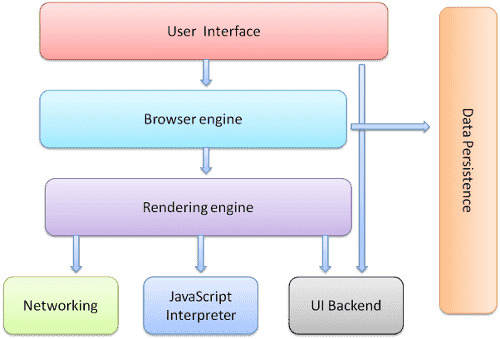
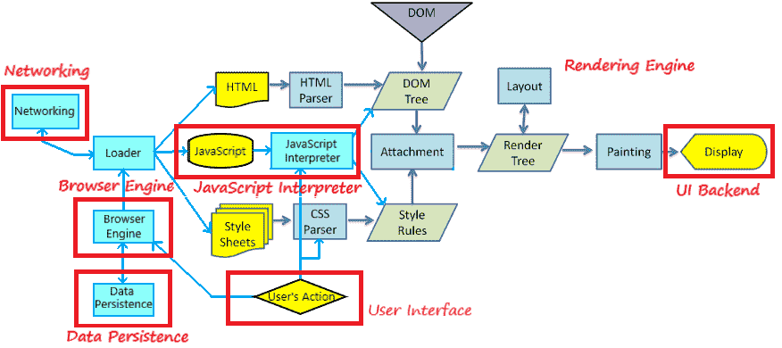
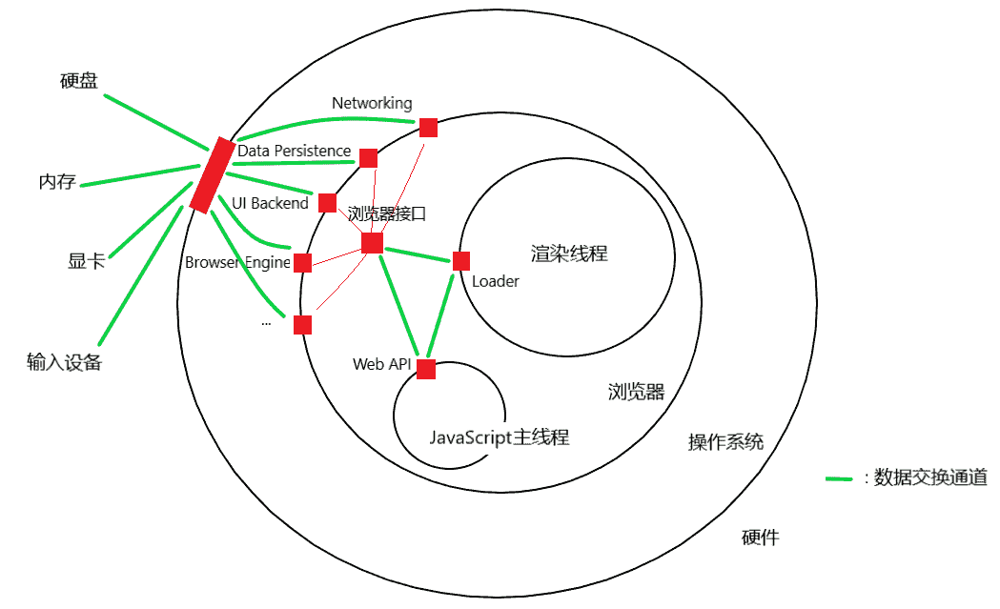

<h1>浏览器基础</h1>

本文包含了浏览器的部分基础内容, 包括浏览器的工作原理, 客户端存储, 以及多线程的相关问题, 不是教程, 不以总结全面为目标, 仅仅是记录下自己觉得有价值的点, 作为参考. 本文包含了很多个人理解, 不一定是正确的, 这是我当前的认知水平.

<!--more-->

## 浏览器的工作原理概述

1. 浏览器的构成.

    

    浏览器主要由以下几个部分构成:
    - 用户界面, 包括地址栏, 前进/后退按钮, 书签菜单等, 即浏览器的"前端"
    - 浏览器引擎, 在用户界面和渲染引擎之间传送指令(说实话我不清楚这一部分的真正角色, 可能各套壳浏览器会修改这一部分吧)
    - **渲染引擎**, 解析HTML和CSS, 并计算页面布局, 确定元素位置
    - JS解释器, 解释和执行JavaScript代码
    - 网络, 用于网络调用, 比如HTTP请求, 公开了与平台无关的通用接口, 而在底层使用操作系统的网络方法(最终是使用**网卡**)
    - 用户界面后端, 用于绘制基本的窗口小部件, 公开了与平台无关的通用接口, 而在底层使用操作系统的用户界面方法(最终是使用**显卡**)
    - 数据存储, 用于浏览器在硬盘保存数据, 也叫数据持久层(最终是使用**硬盘**)

    *此部分参考了<https://www.html5rocks.com/zh/tutorials/internals/howbrowserswork/>.*

2. 浏览器的工作流程. 下面的图片是在[原图片](https://www.html5rocks.com/zh/tutorials/internals/howbrowserswork/webkitflow.png)的基础上, 加上我自己的理解, 绘制的浏览器工作流程图, 使用的是WebKit渲染引擎.
   
    

    在上图中, 我们可以清晰地看到浏览器的工作流程.
    - 浏览器的工作当然是先从`用户界面(User Interface)`开始的. 用户的一些操作, 比如点击链接, 输入url跳往指定地址等会触发指令, 通过`浏览器引擎(Browser Engine)`传往`渲染引擎(Render Engine)`
    - `浏览器引擎(Browser Engine)`还会从`数据持久层(Data Persistence)`中取出储存的数据, 如Cookie, 缓存等, 一并送往`渲染引擎(Render Engine)`
    - 在`渲染引擎(Render Engine)`中, 由`loader`负责接收指令, 并且根据指令调用`网络(Networking)`, 获得相应的文件
    - 获得的文件中, HTML部分交由`HTML Parser`处理, 形成`DOM树(DOM Tree)`; 样式表部分交由`CSS Parser`处理, 形成样式规则; JavaScript部分交由`JavaScript解释器(JavaScript Interpreter)`处理, 把解析结果应用到DOM树和样式规则上. 最终解析完毕的样式规则会附加到DOM树上
    - 之后渲染引擎的`布局(Layout)`工作, 把包含样式规则的`渲染树(Render Tree)`转换成包含坐标信息的渲染树. 在首次布局之后, 再次发生的布局被称为`重排(Relayout)`
    - 之后渲染引擎的`绘制(Paint)`工作, 调用`用户界面后端(UI Backend)`将每个节点绘制出来. 在首次绘制之后, 再次发生的绘制被称为`重绘(Repaint)`

    *此部分参考了<https://www.html5rocks.com/zh/tutorials/internals/howbrowserswork/>.*

3.  大多数情况下, 我们使用Gecko的术语`回流(Reflow)`表示重排的过程.

    - 渲染树中元素的尺寸, 结构或某些属性发生改变时, 会发生回流. 从上面的流程图可以看到, 回流必然引发重绘
    - 当一些不影响元素在布局流中的位置的属性改变时, 如`color` `visibility`, 仅会发生重绘

    由于频繁的回流和重绘会影响性能, 所以在写代码的时候尽量遵循一定的原则避免频繁的回流和重绘:
    
    - 不使用table布局
    - 避免设置多层样式
    - 避免使用CSS表达式(如`calc()`)
    - 将动画效果应用到`position`属性为`absolute`或`fixed`的元素上, 否则会引起父元素的频繁回流
    - 避免频繁使用JavaScript操作样式, 应多次一并修改
    - 避免频繁操作DOM, 可创建`documentFragment`, 在其上面进行DOM操作, 最后附加到DOM树上

4.  HTML的解析过程, 是可能会被普通`<script>`标签的下载和解析阻塞的. 我们知道HTML文件是自上而下解析成DOM的, 当遇到普通`<script>`标签时, 会暂停HTML解析, 进行相应的JavaScript(下载和)解析, 因为此时JavaScript可能会操作DOM.

    CSS不会阻塞HTML解析, 但会阻塞渲染树的生成, 也就是说CSS只有全部解析完毕才会附加到DOM上, 形成渲染树. 然而JavaScript可能会操作样式, 所以浏览器在遇到普通`<script>`标签之前的CSS时就会暂停HTML解析过程, 也就是说普通`<script>`标签之前的CSS会阻塞HTML解析, 之后的CSS就不会阻塞HTML解析了. 这其实是因为每个普通`<script>`解析完之后, 浏览器会渲染一次页面, 所以必须用到之前的CSS.

    DOM解析完毕(HTML解析和JavaScript解析的双重结果)时, 触发`DOMContentLoaded`事件. 当然, 这时的图片啊普通`<script>`标签之后的CSS啊等资源不一定下载解析完毕, 当所有资源下载解析完毕时, 触发`load`事件.

    异步加载JavaScript的两个方式(可以见我的[部分ES6知识-Module部分](https://sien75.github.io/blog/2020/08/12/%E9%83%A8%E5%88%86ES6%E7%9F%A5%E8%AF%86/#Module))中, defer类会在整个同步代码(HTML和普通`<script>`标签中的JavaScript)解析完毕之后再解析, 会阻塞`DOMContentLoaded`事件的触发. 而async类的解析过程会阻塞同步代码解析, 进而阻塞`DOMContentLoaded`事件的触发, 但是如果在同步代码解析后async类内代码才下载完, 那其就不会阻塞`DOMContentLoaded`事件的触发了.

5.  下图为浏览器接口示意图(根据我自己的理解画的), 所谓Web API, 就是指使用JavaScript去读(获得)或写(控制)其它单位的方法. 这里的其他单位可能是渲染引擎, 也可能是其他JS线程, 也可能是硬件, 当然最终都是控制的硬件.
    
    每一种访问都有其专门的接口, 在JavaScript里面体现为一种特定的对象类型. 比如你
    - 想访问渲染引擎里的DOM, 那就用到了`Document`类型
    - 想访问Web Worker线程, 那就用到了`Worker`类型
    - 想在内存里新建一定大小的数据, 那就用到了`ArrayBuffer`类型
    - 想访问硬盘上的二进制文件, 那就用到了`Blob`类型
    - 想通过网卡异步访问互联网的内容, 那就用到了`XMLHttpRequest`类型

    

    DOM接口和BOM接口是使用EcmaScript进行Web开发的基本Web API, 我们把这两部分和EcmaScript合称JavaScript. 但是由于浏览器的日益复杂, 浏览器本身组成部分和支持的硬件越来越多, 所以仅仅使用DOM和BOM无法满足需求. 在这里我倾向于取JavaScript的狭义, 即JavaScript = EcmaScript.
    
    使用JavaScript(EcmaScript)来操作浏览器以及各种硬件, 需要包括DOM接口和BOM接口在内的各种Web API的扶持, 也就是说, Web API实际上赋予了开发者使用JavaScript(EcmaScript)开发各种功能的Web应用的能力, 是构建于JavaScript(EcmaScript)语言之上的.

## 客户端存储 -- *Storage

客户端有2个存储数据的对象.
- localStorage用于长久保存网站数据, 除非手动清除, 不会消失
- sessionStorage用于临时保存网站数据, 关闭窗口或标签页时数据就会被删除
两个对象使用方法都一样, 以localStorage为例:
    ```javascript
    localStorage.data = 1;//设置
    console.log(localStorage.data);//读取(结果为字符串)
    delete localStorage.data;//删除
    localStorage.clear();//全部清除
    ```
    
## 客户端存储 -- IndexedDB

*此部分参考了https://www.ruanyifeng.com/blog/2018/07/indexeddb.html*   
由于cookie大小不能超过4KB, 且每次请求都会发送给服务器; *Storage也有大小限制, 不提供搜索功能, 不能建立自定义的索引. 所以需要一种新的解决方案. IndexedDB是一种NoSQL, 可以在客户端存储大量数据, 还支持二进制储存.

1. 基本概念:
  - 数据库(IDBDatabase对象), 数据总容器, 可以建立多个
  - 对象仓库(IDBObjectStore对象), 每个数据库中包含若干个对象仓库, 类似于SQL中的表
  - 索引(IDBIndex对象), 类似于SQL中的列名
  - 事务(IDBTransaction对象), 数据的增删改查都要通过它完成
  - 操作请求(IDBRequest对象), 打开或新建数据库时获取到的对象
  - 主键, 即默认的索引, 可以指定为某个属性, 也可以是自动生成的递增数据编号

2. 打开, 新建和修改数据库
    通过以下方法打开, 新建或修改数据库:
    ```javascript
    let request = indexedDB.open(dbName, dbVerion);
    ```
    不指定dbVersion, 则使用当前版本. 返回的request是一个`IDBRequest对象`.
    - 如果操作成功则会触发success事件, 此即打开
    - 如果指定的版本高于当前版本, 且操作成功则会触发upgradeneeded事件, 此即修改
    - 如果指定的数据库名字不存在, 且操作成功则会触发upgradeneeded事件, 此即新建
    - 如果操作错误, 则会触发error事件
    3个事件的使用如下:
    ```javascript
    request.onsuccess = function (e) {
        let db = e.target.result;//这是个`IDBDatabase对象`
        db.objectStoreNames;//获得该数据库下所有的
    };
    request.onupgradeneeded = function (e) {//如果要新建数据库的话, 按下面步骤操作
        let db = e.target.result;
        let objStore = db.createObjectStore('newOS', { autoIncrement: true });//这个是`IDBObjectStore对象`
        objStore.createIndex('name', 'name', {unique: false});//这个是`IDBIndex对象`
    };
    request.onerror = function (e) {
        e.target.error;
    };
    ```

3. 数据库内对象仓库的增删改查
    对对象仓库进行增删改查, 需要先获取该`IDBObjectStore对象`. 在新建对象仓库时可以通过`db.createObjectStore`返回值获得该对象, 但是不能这样直接使用, 而是要通过事务对象`IDBTransaction对象`来获得`IDBObjectStore对象`. 通过如下方法获得事务对象:
    ```javascript
    let tsc = db.transaction(['objectStorageName'], 'readwrite');
    ```
    其中db是上面的`IDBDatabase对象`, 之后就可以获取到相应的`IDBObjectStore对象`了:
    ```javascript
    let objStore = tsc.objectStore('objectStorageName');
    ```
    实际的query操作:
    ```javascript
    let query = objStore.add({name: 'sam', age: 18});//增
    let query = objStore.delete(1);//删, 使用主键值作为参数
    let query = objStore.put({name: 'amy', age: 19}, 1);//改, 第二个参数是主键值
    let query = objStore.get(1);//查, 使用主键值作为参数
    let query = objStore.index('name').get('sam');//查, 使用索引作为参数
    let query = objStore.openCursor();//遍历, 监听query的success事件
    //以上query都有success和error事件, 都是`IDBRequest对象`, 在监听函数内部通过e.target.result或this.result或query.result访问到结果
    
    //使用监听函树实例(遍历):
    query.onsuccess = function (e) {
        let cursor = e.target.reuslt;
        if(cursor) {
            console.log(cursor.value, cursor.key);
            cursor.continue();
        }
    }
    ```

## 多线程

1.  浏览器的进程和线程
  
    `进程(process)`是操作系统分配资源的最小单位, `线程(thread)`是程序执行的最小单位; 进程由线程组成, 进程间相互独立, 同一进程的线程之间共享资源; 线程切换比进程快.

    Chrome浏览器使用的是多进程隔离不同的标签页, 在每一个进程中, 有着渲染引擎线程, JavaScript主线程, 定时器线程, 事件线程以及网络线程等. 除了各标签页进程外, Chrome还有主进程, 扩展程序进程等.

2.  `Web Worker`和`Service Worker`
  
    JavaScript是设计用来操作DOM的语言, 为了避免复杂性, JavaScript是一种**单线程**语言. 由于JavaScript主线程和渲染引擎线程互斥, 所以如果JavaScript主线程上有一些耗时的代码, 那么必然会阻塞其他代码的执行, 也会阻塞页面的渲染. 所以, 如果我们需要运行一些耗时的代码时, 完全可以开辟一个新的线程, 这就是`Web Worker`. `Web Worker`实际上是存在于标签页进程内部的线程.

    然而`Web Worker`是跟随标签页进程的, 当标签页关闭了, 其工作也就结束了. 如果想持久化, 那就需要`Service Worker`.

    `Service Worker`本身也是一个新的线程, 但是它是独立于标签页线程的, 标签页的关闭不会导致其结束. 而且, `Service Worker`还被赋予中间人代理的权利, 即抓取网络请求并作出修改, 再送给渲染引擎的权利. 借着这两点, 它可以做到对网络请求文件的缓存, 使页面可以离线访问. 它还有消息推送的能力, 使得Web网页变得更像一个本地应用.

3.  事件循环(Event Loop)

    *关于Node.js的事件循环, 见我的关于Node.js的文章[Node.js基础](https://sien75.github.io/blog/2020/09/08/Node-js%E5%9F%BA%E7%A1%80/#%E4%BA%8B%E4%BB%B6%E5%BE%AA%E7%8E%AF-Event-Loop)*

    在Web中, 有大量的多线程操作, 比如I/O(ajax, 读文件等), UI交互, 定时器, 上面提到的Worker等, 为了不阻塞主线程, 它们最好是**异步**运行, 基于**事件**来通知主线程. 同时, 我们还可以通过Promise来对它们包装(Promise代表执行顺序, 是一种异步包装方式, 本身不会开辟新线程执行代码).

    浏览器的异步执行方式是这样的:

    JavaScript主线程中JavaScript解释器自上而下解释主任务代码, 根据作用域链对执行栈进行压栈弹栈, 遇到多线程代码会开辟子线程处理. 子线程的代码只要执行完毕, 就会触发事件通知主线程, 并往任务队列里面添加任务. 主线程接到事件通知, 待空闲时就会检测任务队列, 只要其中有任务, 就出队一个任务, 将其压入执行栈执行, 执行完毕后再次在任务队列里取任务, 直到任务队列为空. 这就是`事件循环(Event Loop)`机制.

    如下图所示, 任务分为两种, `micro task(微任务)`和`macro task(宏任务)`, 前者主要包含包含`Promise`, 后者包含主任务, `setTimeout`, `setInterval`, I/O, UI交互, postMessage等. JavaScript主线程会先从宏任务队列中出队一个任务来执行(第一次取出的就是主任务), 任务执行完毕后再读取微任务队列, 并按顺序执行所有的微任务, 只有微任务队列没有事件时, 才会再次读取宏任务队列. 这样的话, 如果某些前面的任务执行特别耗时间的话, `setTimeout`和`setInterval`这些函数的定时可能是不准确的.

    

    关于`requestAnimationFrame`, 它是异步执行(基于事件)的, 但它既不是微任务, 也不是宏任务. 可以认为还存在一个`requestAnimationFrame`任务队列, 在每次事件循环的渲染步骤前(参考上图), 会检测是否有`requestAnimationFrame`任务, 并全部执行.

    > 在现代Chrome浏览器里面, `setTimeout`和`setInterval`的时间最小设置值是1(ms), 也就是说第二个参数设为1和0是一样的.

    > 由于一方面不好确认浏览器的最佳刷新间隔, 另一方面`setTimeout`和`setInterval`受到事件循环中延时的影响更大, 所以自定义动画推荐使用`requestAnimationFrame`.

    下面是关于浏览器事件循环的例子:
    ```javascript
    setTimeout(() => {console.log('setTimeout0');}, 0);

    let promise = new Promise(function(resolve, reject) {
        console.log('Promise');
        setTimeout(() => {console.log('setTimeout1')}, 0);
        resolve();
    });

    (async function () {
        await promise;
        console.log('resolved');
    }());

    console.log('Hi!');

    /*
    依次显示
    Promise
    Hi!
    resolved
    setTimeout0
    setTimeout1
    */
    ```

## Web Worker

*此部分参考了<http://www.ruanyifeng.com/blog/2018/07/web-worker.html>*

1.  基本用法.

    主线程(JavaScript解释器线程):
    ```js
    let worker = new Worker('work.js');
    worker.postMessage({content: 'Hello'});
    worker.onmessage = function (e) {
      console.log(e);
      console.log('main thread recieved message!');
    }
    worker.onerror = console.error;
    ```
    Worker线程全局环境绑定了监听函数和消息发送函数, work.js的内容如下:
    ```js
    onmessage = function (e) {
        console.log(e);
        console.log('web worker recieved message!');
        postMessage({content: 'Hello too'});
    }
    ```
    关闭Worker线程:
    ```js
    worker.terminate();//主线程内
    close();//Worker线程内
    ```

2.  数据通信.

    主线程和Worker线程之间的通信是拷贝的关系, 即先把通信内容串行化(转换成字符串), 接收方再将其还原. 主线程和Worker线程之间也可以交换二进制数据, 但是如果二进制数据太大, 这样的拷贝既浪费时间, 又浪费存储资源. 在此, 可以通过直接将二进制数据转移给Worker线程.
    ```js
    let ab1 = new ArrayBuffer(16);
    let ab2 = new ArrayBuffer(16);
    worker.postMessage(
        {ab1, ab2},
        [ab1, ab2]
    );
    ```
    其中第一个参数就是指传递的变量, 第二个参数是一个数组, 包含了需要转移的二进制数据变量名.

3.  同文件的Web Worker.   
   
    使用Web Worker可以不用单独的文件, 借助Blob类型的URL构造能力, 可以在单个文件内创建Web Worker.
    ```
    let work = function () {
        //web worker codes
    }
    let blob = new Blob(`(${work.toString()})()`);
    let url = URL.createObjectURL(blob);
    let worker = new Worker(url);

    //或者
    let work = `
        //web worker codes
    `;
    let blob = new Blob(work);
    let url = URL.createObjectURL(blob);
    let worker = new Worker(url);   
    ```

## Service Worker

建议参考<https://lavas-project.github.io/pwa-book/chapter04.html>, 文章把Service Worker作为PWA技术的一部分, 讲解得非常详实. 由于Service Worker并不是一种基础知识, 在此我就不总结了.

