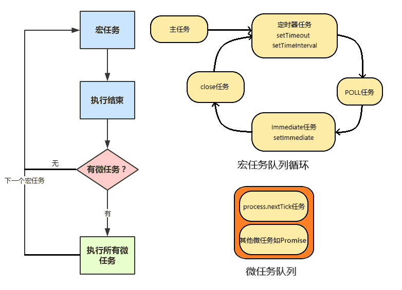

<h1>Node.js基础</h1>


本文包含了Node.js的部分基础内容, 参考了<http://nodejs.cn/learn>, 请注意本文不是教程, 不以总结全面为目标, 仅仅是记录下自己觉得有价值的点, 作为参考.

<!--more-->

## 事件循环(Event Loop)

*关于浏览器的事件循环, 见我的关于浏览器的文章[浏览器基础](https://sien75.github.io/blog/2020/08/31/%E6%B5%8F%E8%A7%88%E5%99%A8%E5%9F%BA%E7%A1%80/#%E5%A4%9A%E7%BA%BF%E7%A8%8B).*

首先我们要表述一下Node.js的事件循环, 在我基本弄清浏览器的事件循环之后, Node.js的事件循环对我的认知冲击了好多次, 我也不知道为啥要设计得这么复杂这么拗[摊手]... 说实话Node.js的事件循环有很多的坑, 主要有以下几个方面:
- 加入了`process.nextTick`, 你可以认为它是微任务, 但它总在其他微任务之前(说好的队列先进先出, 但它有"军人优先"的权利)
- 加入了`setImmediate`, 但是并不一定是"立刻"执行, 并不如`process.nextTick`快
- 之前是每执行完一个阶段的所有宏任务才会去执行微任务, 但是新版本Node.js向浏览器看齐了, 即每单个宏任务后都会清空微任务队列(很多旧教程都是错的啊)
- 如果主线程在执行定时器任务, 那么此时产生的任务会被加入到下一个循环中, 在执行Immediate任务时也是这样(文档里也没提啊)

在Node.js中, 有大量的多线程操作, 比如I/O(ajax, 读文件等), 定时器等, 为了不阻塞主线程, 它们最好是**异步**运行, 基于**事件**来通知主线程. 同时, 我们还可以通过Promise来对它们包装(Promise代表执行顺序, 是一种异步包装方式, 本身不会开辟新线程执行代码).

此外, Node.js还规定了`process.nextTick`和`setImmediate`这两个函数, 用于在异步操作的不同时机触发事件, 产生任务.

Node.js的异步执行方式和之前好像有出入, 以下结论基于Node.js(v14.5.0)的结果.

Node.js的异步执行方式是这样的:

JavaScript主线程中JavaScript解释器自上而下解释主任务代码, 根据作用域链对执行栈进行压栈弹栈, 遇到多线程代码会开辟子线程处理. 子线程的代码只要执行完毕, 就会触发事件通知主线程, 并往任务队列里面添加任务. 主线程接到事件通知, 待空闲时就会检测任务队列, 只要其中有任务, 就出队一个任务, 将其压入执行栈执行, 执行完毕后再次在任务队列里取任务, 直到任务队列为空. 这就是`事件循环(Event Loop)`机制.

如下图所示, 任务分为两种, `micro task(微任务)`和`macro task(宏任务)`, 前者主要包含`process.nextTick`, `Promise`, 后者包含主任务, `setTimeout`, `setInterval`, I/O, `setImmediate`等. JavaScript主线程会先从**宏任务队列循环**中出队一个宏任务(第一次取出的就是主任务), 执行这个宏任务, 任务执行完毕后再读取微任务队列, 并按顺序执行所有的微任务, 只有微任务队列没有事件时, 才会再次读取宏任务队列循环. 读取宏任务先读取本宏任务队列, 只有本宏任务队列没有任务时, 才会按照循环读下一个宏任务队列.



和浏览器不同的是, 首先我们可以认为Node.js的事件循环的微任务队列中`process.nextTick`总是在最前面的, 再者Node.js的宏任务队列有多个, 每次读宏任务都要清空本宏任务队列, 才会去读下一个宏任务队列.

另外, Node.js和浏览器的退出机制不同, 这对事件循环有一定的影响. 和浏览器一样的是, Node.js也是只要有事件就会启动事件循环, 清空了队列就会停止事件循环. 不过, 浏览器中不用考虑退出机制, 因为用户自己会退出, 整个页面打开的过程主线程是一直在监听事件的; Node.js不一定会有用户触发的事件, 事情做完了自己会退出, 事件循环也就停止了. Node.js主线程会记录是否还有进行中的子线程(定时器, I/O等), 有的话就会阻塞在poll阶段等待事件, 没有的话就会退出.

> 在Node.js中, `setTimeout`和`setInterval`的时间最小设置值是1(ms), 也就是说第二个参数设为1和0是一样的. 不过有时把第二个参数设为2也会表现为和1一样(玄学), 所以使用定时器函数时最好把时间间隔设为大于4ms.

注意, 在执行定时器任务时, 新的任务会被添加到下一个循环. 对于Immediate任务来说也是如此. 这一点可以在下面的例子中看出('setTimeout2').

下面是关于Node.js事件循环的例子:
```js
setTimeout(() => {
    console.log('setTimeout0');
    (async () => {
        await new Promise(_ => {
            console.log('Promise');
            _();
        });
        setTimeout(() => {
            console.log('setTimeout2');
        });
        console.log('resolved');
    })();
});
setTimeout(() => {
    console.log('setTimeout1');
    process.nextTick(() => {
        console.log('nextTick');
        setImmediate(() => {
            console.log('setImmediate');
        });
    });
});
console.log('Hi!');
/*
依次显示:
Hi!
setTimeout0
Promise
resolved
setTimeout1
nextTick
setImmediate
setTimeout2
*/
```

## process对象

1.  退出进程

    可以使用`process.exit(n)`来强制退出进程, 其中`n`代表退出码. 退出码表示进程退出时返回的一个数字, 用于和其他进程通信. 设置退出码还可以通过`process.exitCode = 1`来设置, 这样不仅`process.exit()`时会使用该退出码, 进程自然结束时也会使用该退出码. 当然, 不同的退出码有不同的意义, 不同的情况会自动触发不同的退出码, 比如`1`代表"未捕获异常". 所以一般不通过编程操作退出码.

2.  向进程发送信号

    使用`process.kill(pid, signal)`来向进程发送信号. pid为进程id, 使用`process.pid`获得本进程PID; signal为信号, 为字符串或数字, 如`SIGTERM`或`15`表示正常终止(非Windows), `SIGKILL`或`9`表示立即终止. 

    有些信号可以绑定事件监听器, 通过`process.on(signal, handle)就可以设置回调函数.

    通过`process.kill(pid, signal)`关闭进程, 那么进程的退出码将会是128加上信号的值.

3.  使用`process.nextTick`进行异步操作, 详见[事件循环](#事件循环-Event-Loop).

4.  使用`process.env`读取系统环境变量.

5.  使用`process.argv`访问命令行参数.

## 通过命令行I/O

1.  使用`console`对象输出.(和浏览器基本相同)
    - `console.log()`
    - `console.clear()`, 但是Node.js中没有浏览器中的clear()函数
    - `console.count()`, 打印字符串并计数
    - `console.trace()`, 打印堆栈踪迹
    - `console.time(tag)` `console.timeEnd(tag)`, 计算两者间时间并输出到控制台
    - `console.error()`, 打印到错误流, 不会再控制台上显示
    - 使用`chalk`软件包对控制台输出着色(npm安装)

2.  从命令行接收输入.
    - 使用`readline`模块
    ```js
    const readline = require('readline').createInterface({
        input: process.stdin,
        output: process.stdout
    });
    readline.question('你叫什么名字?', name => {
        console.log(`你好 ${name}!`);
        readline.close();
    })
    ```
    - 使用`Inquirer`软件包(npm安装)
    ```js
    const inquirer = require('inquirer')
    var questions = [
        {
            type: 'input',
            name: 'name',
            message: '你叫什么名字?'
        }
    ]
    inquirer.prompt(questions).then(answers => {
        console.log(`你好 ${answers['name']}!`)
    })
    ```

## npm
1.  安装软件包

    - `npm i package` `npm i package -S` `npm i package --save`, 安装软件包到当前项目
    - `npm i package -D` `npm i package --sav-dev`, 安装仅开发依赖的软件包到当前项目
    - `npm i package -g`, 全局安装软件包, 一般会添加可执行文件
    - `npm i package@n.n.n`, 指定版本安装软件包

2.  查看软件包

    - `npm list`, 列出当前项目的依赖包
    - `npm list --depth=0`, 仅列出顶层依赖包, 即写在`package.json`里的依赖包
    - `npm list -g`, 列出全局安装的软件包

3.  运行可执行文件

    - `npx exe_name`, 运行可执行文件, 依次搜索本项目安装的依赖包, $PATH和网络是否有此可执行文件
    - `exe_name`, 安装在全局的软件包的可执行文件可直接运行($PATH包含的话)

4.  更新软件包

    - `npm view package version`, 查看指定软件包的最新版本
    - `npm outdated`, 查看当前项目的所有软件包的最新版本
    - `npm update`, 更新次版本或补丁版本变动的软件包, 不会更新主版本变动的软件包

5.  卸载软件包

    - `npm uninstall package`, 卸载软件包, 但不会修改`package.json`
    - `npm uninstall package -S`, 卸载软件包, 同时删除`package.json`的`dependencies`中此软件包的字段
    - `npm uninstall package -D`, 卸载软件包, 同时删除`package.json`的`devDependencies`中此软件包的字段

6.  `package.json`中的语义版本控制

    - `>`, 高于指定版本的任何版本
    - `>=`, 等于或高于指定版本的任何版本
    - `<`, 低于指定版本的任何版本
    - `<=`, 低于或高于指定版本的任何版本
    - `=` `[无前缀]`, 确切的版本
    - `^`, 补丁版本和次版本高于指定版本的任何版本
    - `~`, 补丁版本高于指定版本的任何版本
    - `n.n.n - n.n.n`, 版本范围
    - `||`, 组合规则
    - `latest`, 最新版本

## EventEmitter

*我的疑问: EventEmitter是怎么和Event Loop结合的呢? eventEmitter.emit()这个函数是在什么地方被调用的呢?*

```js
const EventEmitter = require('events');
const eventEmitter = new EventEmitter();
eventEmitter.on('event', (a, b) => {
    console.log(a, b);
});
eventEmitter.emit('event', 0, 1);
console.log(2);

//等同于

const _ = (a, b) => {
    console.log(a, b);
};
_(0, 1);
console.log(2);
```
EventEmitter只是改变了"回调地狱"的书写方式, 本身还是同步运行的.

## 其他

其他的关于fs, http, stream, buffer就不多介绍了, 都是看一看就会的.

不过有一点要提一下. ArrayBuffer是es6里面规定的, 代表储存二进制数据的一段内存.

而TypedArray也是es6里面规定的, 是以指定格式解读ArrayBuffer的一种方法, Uinit8Array是TypedArray(视图)的一种.

Node.js中的Buffer类就是继承自Uint8Array. Buffer类的对象内部实际存在一个ArrayBuffer类的对象, 所以可以认为Buffer是ES6标准中的ArrayBuffer和Uinit8Array的结合体.

请看下面ArrayBuffer和Buffer互转的例子:
```js
//把ArrayBuffer转换成Buffer(1)
let ab = new ArrayBuffer(16);
let view = new Uint8Array(ab);
let buf = Buffer.alloc(ab.length);
for(let i = 0; i < ab.length; i++) buf[i] = view[i];

//把Buffer转换成ArrayBuffer(1)
let buf = Buffer.alloc(16);
let ab = new ArrayBuffer(buf.length);
let view = new Uint8Array(ab);
for(let i = 0; i < buf.length; i++) view[i] = buf[i];

//把ArrayBuffer转换成Buffer(2)
let ab = new ArrayBuffer(16);
let buf = Buffer.from(ab);

//把Buffer转换成ArrayBuffer(2)
let buf = Buffer.alloc(16);
let ab = buf.buffer;
```