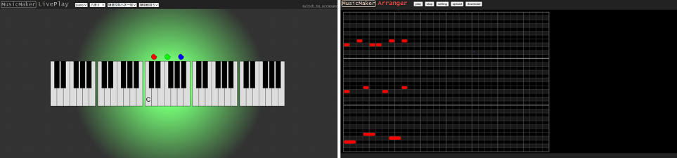

<h1>MusicMaker编写记录1-Webpack配置与项目搭建</h1>

MusicMaker是我打算做的一个支持**音乐展示**, **即时演奏**和**简单编曲**的JavaScript库, 这是我记录编写过程的文章.

<!--more-->

---

## MusicMaker简介

MusicMaker是我打算做的一个支持**音乐展示**, **即时演奏**和**简单编曲**的JavaScript库, 打算使用Web前端技术做, 跨Web和所有Native端. 做这个项目的目的有两个, 一个是为了实现自己的这个想法, 另一个是练习Web前端技术. 而且这种自己从头规划, 慢慢制作是很有成就感的!

自己玩的项目, 不好说啥时候更新, 大家看个乐就行了.

**项目地址: <https://github.com/sien75/musicmaker>**

**本次版本: <https://github.com/sien75/musicmaker/tree/7d6d162c407fc87a386fa6d4d4189c6ea2367150>**

**Docs: <https://sien75.github.io/musicmaker>**

---

## 项目设想

之前第一版的MusicMaker分为两个部分: LivePlay和Arranger. LivePlay部分是一个键盘乐器, 可以即时演奏, 算是基本完成的. Arranger部分嘛..., 我是想做一个编曲+展示的页面. 想做的功能挺多的, 但是做到的只是个半成品.



第一版使用的技术是最基础的HTML+CSS+JavaScript, 搁置了很久, 但是我是一直想把这个东西做下去的. 两年过去了, 我现在已经接触到了更多的前端技术, 所以我打算另起炉灶, 用新技术重新构思, 做第二版!

这次我带来了几个超强的武器: Webpack, React, TypeScript. 项目搭建伊始要规划的事很多, 但主要工作就是把Webpack配置好. 在Webpack的配置过程中, 就能把项目的基本要素都串起来.

不过一切的开始, 应该是 -- 新建一个文件夹:


当然, 由于我是从Github上直接拉下来的项目, 所以是有git版本控制的. 我把项目中的文件和文件夹放到另一个分支备份, 然后把master分支清空了.

如果是对于一个没有git的空文件夹, 那么第一步无疑是执行以下命令:
```shell
git init
```
在有了git的版本控制后, 我们接下来要干什么呢? 没错, 接下来要进行npm初始化, 生成`package.json`文件, 这个文件是node项目的核心文件:
```shell
npm init
```
这样一个node项目就初始化完成了! 接下来进行目录规划:
```
|- musicmaker
    |- build
        |- lib
            |- ...
        |- doc
            |- ...
    |- src
        |- ...
    |- examples
        |- ...
    |- public
        |- ...
    |- package.json
    |- .gitignore
```
* `src`, 目录下是MusicMaker的库原始代码, 这一部分是Musicmaker的核心功能部分
* `examples`, 目录下是对MusicMaker库的使用, 也就是说这一部分是用于向其他人介绍使用方法, 并展示效果的
* `build/lib`, 目录下是生成的库文件
* `build/doc`, 目录下是构建好的`examples`页面(即Docs页), 这一部分会直接部署到项目的GitHub Page上

---

## 如何构建

一个项目的基础骨架搭建好了, 接下来就是注入灵魂的时候了:
```shell
npm i -D webpack webpack-cli webpack-dev-server
```

我打算使用Webpack构建Docs页, 并用Webpack构建既可以使用`<script>`标签引入, 也可以使用`import`引入的MusicMaker库.

但是使用MusicMaker库依赖React, 直接在`<script>`标签里写JSX, 不是一件明智的行为. 所以我取消了库可以用`<script>`标签引入的打算.

我一开始也打算用Webpack构建MusicMaker库, 但是Webpack会把一个entry打包成一个文件输出, 无法保持原目录结构, 也无法生成.d.ts文件, 所以构建库需要另选工具.

使用Typescript的命令行工具`tsc`可以直接生成`.d.ts`文件, 所以这是一个构建库的不错的工具. 对于库来说CSS和JavaScript的构建是两条生产线, 我使用`sass`命令行工具来实现`.scss`文件的编译.

`package.json`内容如下:
```js
// package.json
"scripts": {
    "start": "webpack serve --config webpack/config.doc.dev.js",
    "build": "webpack --config webpack/config.doc.js",
    "build:lib": "rm -rf build/lib/* && tsc --project tsconfig.lib.json && sass src:build/lib --no-source-map"
}
```
Webpack的主要功能有两个: A -- "开发"到"发布"的转换, B -- 实时观察"开发"的效果. 在这里面, `start`是使用的B功能, `build`是使用的A功能.

`start`是会以`examples`文件夹的文件为入口, 而`examples`内的文件会依赖`src`内的核心库文件. 这个是用于实时开发, 观察Docs页的效果. 当然我也会借用此来调试MusicMaker库.

`build`就是构建Docs页, `start`是即时开发, 而`build`则是输出构建好的文件, 构建好的页面会直接部署到Github Page上. 和`start`一样, `build`会以`examples`文件夹的文件为入口, 而`examples`内的文件会依赖`src`内的核心库文件.

`build:lib`是构建MusicMaker库的命令, 这个命令都会以`src`目录下的文件为入口, 涉及`src`目录下的文件, 但不会涉及`examples`下的文件. 这里3个命令作用为:
* `rm -rf build/lib/*`, 删除原有的库文件
* `tsc --project tsconfig.lib.json`, 使用`tsc`编译`.tsx`生成`.js`和`.d.ts`文件
* `sass src:build/lib`, 使用`sass`编译`.scss`生成`.css`

项目的Webpack配置文件都会放在`webpack`文件夹内, `entries.js`, `plugins.js`和`loaders.js`这3个基本的配置文件, 是会被各`config.xxx.js`依赖的.

项目使用Babel来配合Webpack编译`.tsx`文件, Babel配置文件为项目根目录下的`.babelrc`文件.

项目的TypeScript配置文件为`tsconfig.json`, 不过这个只是用于智能提醒编辑器的, 真正的`tsc`编译时使用的配置文件是`tsconfig.lib.json`.
```
上述提及的配置文件位置如下:
|- musicmaker
    |- ...
    |- webpack
        |- entries.js
        |- plugins.js
        |- loaders.js
        |- config.doc.dev.js
        |- config.doc.js
        |- config.lib.js
    |- package.json
    |- .babelrc
    |- tsconfig.json
    |- tsconfig.lib.json
```

接下来我会详细描述项目的各个配置项.

---

## Webpack配置 - entries.js

先从Webpack的配置说起吧.

首先看`entries.js`, 我会把所有的`entry`和`output`以及`resolve`写在这里. 基本内容如下:
```js
// entries.js

const path = require('path');
module.exports = {
    entry: path.resolve(__dirname, '../examples/index.tsx'),
    output: {
        filename: '[name].js',
        path: path.resolve(__dirname, '../build/doc'),
    },
    resolve: {
        extensions: ['.tsx', '.ts', '.jsx', '.js'],
        alias: {
            musicmaker: path.resolve(__dirname, '../src'),
        },
    },
};
```
当然Docs页是个多页面情况, 肯定不止一个entry, 以后会动态添加的. 设置别名`musicmaker`是为了在引入MusicMaker库的时候更方便, 更接近使用场景:
```js
// 设置的话
import MusicMaker from 'musicmaker';
// 不设置的话
import MusicMaker from '../musicmaker';
import MusicMaker from '../../../musicmaker';
```

---

## Webpack配置 - plugins.js

我会把所有`plugins`和`optimization`的配置放在这里.

项目需要安装4个插件: html-webpack-plugin, clean-webpack-plugin, mini-css-extract-plugin和css-minimizer-webpack-plugin, 首先安装它们:
```shell
npm i -D html-webpack-plugin@next clean-webpack-plugin mini-css-extract-plugin css-minimizer-webpack-plugin
```

### HTML模板插件和清空输出文件夹插件
先看一下前两个插件, `plugins.js`文件包含以下代码:
```js
// plugins.js
const path = require('path');
const cwp = new (require('clean-webpack-plugin').CleanWebpackPlugin)();
const hwp = new (require('html-webpack-plugin'))({
    title: 'MusicMaker',
    favicon: path.resolve(__dirname, '../public/favicon.ico'),
    template: path.resolve(__dirname, '../public/index.html'),
});
const plugins = [cwp, hwp];
```

CleanWebpackPlugin是用来在清除旧的构建文件的, 而HtmlWebpackPlugin是创建主html文件的.

### JavaScript代码分离
代码分离是Webpack的一个很有用的功能. 试想一下, 两个entry共用一个依赖库, 然后把依赖库各自打包到自己的bundle文件里. 这种代码重复的情况, 造成了打包体积过大, 浪费存储和网络资源, 且很不优雅.

我们在这里用到了`SplitChunksPlugin`这个插件(无需额外安装), 这个插件可以把共用的依赖库提取出来, 使一份代码仅被打包一次, 避免JavaScript代码重复. 在`plugins.js`里新加入下面的代码:
```js
// plugins.js
const optimization = {
    splitChunks: {
        chunks: 'all',
    },
};
```

### CSS代码分离
同样的, 项目也需要对CSS代码进行分离操作. 对CSS代码分离需要修改`plugins`和`loader`两部分, 出于速度方面的考虑, 仅在生产模式启用这一功能:
```js
// plugins.js
const devMode = process.env.NODE_ENV !== 'production';
const mcepFun = () => new (require('mini-css-extract-plugin'))({});
const plugins = devMode ? [cwp, hwp] : [cwp, hwp, mcepFun()];
```

### 代码压缩
Webpack5会对生产模式下输出的JavaScript代码进行压缩, 这里需要配置的是CSS的代码压缩. 这里使用到的插件是`css-minimizer-webpack-plugin`, 修改`plugins.js`代码如下:
```js
// plugins.js
const devMode = process.env.NODE_ENV !== 'production';
const cmwpFun = () => new (require('css-minimizer-webpack-plugin'))();
const optimization = {
    splitChunks: {
        chunks: 'all',
    },
    minimizer: devMode ? ['...'] : ['...', cmwpFun()],
};
```

### 完整配置
至此, `plugins.js`完成, 完整的配置文件如下:
```js
// plugins.js

const path = require('path');
const devMode = process.env.NODE_ENV !== 'production';

const cwp = new (require('clean-webpack-plugin').CleanWebpackPlugin)();
const hwp = new (require('html-webpack-plugin'))({
    title: 'MusicMaker',
    favicon: path.resolve(__dirname, '../public/favicon.ico'),
    template: path.resolve(__dirname, '../public/index.html'),
});
const mcepFun = () => new (require('mini-css-extract-plugin'))({});
const cmwpFun = () => new (require('css-minimizer-webpack-plugin'))();

const plugins = devMode ? [cwp, hwp] : [cwp, hwp, mcepFun()];
const optimization = {
    splitChunks: {
        chunks: 'all',
    },
    minimizer: devMode ? ['...'] : ['...', cmwpFun()],
};
module.exports = { plugins, optimization };
```

---

## Webpack配置 - loaders.js

接下来是很重要的Loader配置, 目前我想到的就是解析`.tsx`和`.scss`, 也就是解析TypeScript, React和Sass, 后续如果需要解析其他类型文件的话再进一步修改. 首先把本体们安装上:
```shell
npm i -D typescript
npm i react react-dom
npm i -D sass
```

### 解析`.tsx`
我会使用Babel对TypeScript, React和ES新特性进行解析, 安装命令如下:
```shell
npm i -D babel-loader @babel/core @babel/preset-env @babel/preset-react @babel/preset-typescript
npm i core-js regenerator-runtime
```
* `@babel/core`是Babel的核心模块
* `@babel/preset-react`是Babel用于编译React的preset
* `@babel/preset-typescript`是Babel用于编译TypeScript的preset
* `core-js`和`regenerator-runtime`是为了使用如Promise等新特性而需引入的polyfill
* `babel-loader`是Webpack使用Babel的Loader

现在编写`loader.js`配置文件, 内容如下:
```js
// loader.js
const path = require('path');
const include = [
    path.resolve(__dirname, '../src'),
    path.resolve(__dirname, '../examples'),
];
module.exports = {
    module: {
        rules: [
            {
                test: /\.(t|j)sx?$/,
                loader: 'babel-loader',
                options: { cacheDirectory: true },
                include,
            },
        ],
    },
};
```
在项目根目录创建Babel的配置文件`.babelrc`, 内容如下:
```json
// .babelrc
{
    "presets": [
        [
            "@babel/env",
            {
                "targets": "defaults", // 以主流浏览器为构建目标
                "useBuiltIns": "usage", // 按需引入polyfill
                "corejs": 3, // core-js的版本
            }
        ],
        "@babel/preset-react",
        "@babel/preset-typescript"
    ]
}
Babel的`presets`是有顺序的, 按照从下到上的顺序解析.
```

### 解析`.scss`
解析Sass需要安装3个Loader:
```shell
npm i -D sass-loader css-loader style-loader
```
它们的作用分别如下:
* `sass-loader`, 把Sass编译成CSS
* `css-loader`, 把CSS转换成JavaScript
* `style-loader`, 把JavaScript转换成\<style\>节点

在生产环境把"CSS in JavaScript"转换成CSS文件需要`mini-css-extract-plugin`插件, 这个我们在代码分离部分说过.

安装完Loader后, 再编写loaders.js文件, 新增解析Sass的部分:
```js
// loader.js
const path = require('path');
const devMode = process.env.NODE_ENV !== 'production';
const mcepLoaderFun = () => require('mini-css-extract-plugin').loader;
const include = [
    path.resolve(__dirname, '../src'),
    path.resolve(__dirname, '../examples'),
];
module.exports = {
    module: {
        rules: [
            {
                test: /\.(t|j)sx?$/,
                loader: 'babel-loader',
                options: { cacheDirectory: true },
                include,
            },
            {
                test: /\.scss$/,
                use: [
                    devMode ? 'style-loader' : mcepLoaderFun(),
                    'css-loader',
                    'sass-loader',
                ],
                include,
            },
        ],
    },
};
```

---

## Webpack实际配置文件

前面说的是基础的配置, 只不过是分到了3个文件里, 现在要把这3个文件整合起来. 项目有2个Webpack命令, 需要2个配置文件, 内容很好理解:
```js
// config.doc.js
process.env.NODE_ENV = 'production';
module.exports = {
    mode: 'production',
    ...require('./entries'),
    ...require('./plugins'),
    ...require('./loaders'),
};
```
```js
// config.doc.dev.js
process.env.NODE_ENV = 'development';
module.exports = {
    mode: 'development',
    ...require('./entries'),
    ...require('./plugins'),
    ...require('./loaders'),
    devtool: 'eval-cheap-module-source-map',
    devServer: {
        open: true,
        contentBase: '../build/doc',
    },
};
```
在`config.doc.dev.js`里, 要配置好用于实时开发的`devtool`和`devServer`.

---

## TypeScript配置

使用Babel的TypeScript插件是不会顾及`tsconfig.json`的内容的, 我们这里有2个TypeScript配置文件, 内容基本一致. `tsconfig.json`文件内容如下:
```json
// tsconfig.json
{
  "compilerOptions": {
    "target": "es2015",
    "module": "es2015",
    "jsx": "react", // 支持react
    "declaration": true, // 生成.d.ts文件
    "outDir": "./build/lib",
    "rootDir": "./",
    "strict": true,
    "moduleResolution": "node",
    "baseUrl": "./",
    "paths": {"musicmaker": ["src"]}, // 配合baseUrl, 设置别名
    "esModuleInterop": true,
    "skipLibCheck": true,
    "forceConsistentCasingInFileNames": true
  },
  "include": [
    "src", "examples"
  ]
}
```
我们的`src`和`examples`目录都使用了TypeScript, 为了让VSCode正确提示不报错, 所以`include`字段里包含了这连个目录. 但是, 使用`tsc`构建的时候, 只构建`src`目录, 所以需要另写一份配置文件, 更改的地方如下:
```json
// tsconfig.lib.json
{
  "compilerOptions": {
    "rootDir": "./src",
  },
  "include": [
    "src"
  ]
}
```

## 关于VSCode插件

我在项目里用到了下面的插件:

### ESLint
ESLint是用于JavaScript/TypeScript/JSX/TSX/CSS/Sass等的语法检测的, 可以有效防止一些错误, 需先通过npm安装:
```shell
npm i -D eslint
```
我把ESLint安装到了项目本地目录, 你也可以把它安到全局. 安装完成以后, 初始化ESLint. 在项目根目录执行以下命令:
```shell
npx eslint --init
```
根据项目选择合适的选项, 比如我的这个项目是要用到React和TypeScript的, 那相应的选项要选择true. 命令执行后会生成一个`.eslintrc.js`文件.

之后我们可以安装VSCode的ESLint插件了, 插件会根据`.eslintrc.js`的配置对项目的文件语法进行检测, 对不符合规则的代码提出警告.

### Prettier
安装VSCode的Prettier插件, 可以使代码的风格更加规范, 增强可读性. Prettier并不会对代码的语法进行检测, 它只是去对代码进行无语义变更的格式化.

安装Prettier的命令如下:
```shell
npm i -D prettier
```

打开VSCode设置的`Format On Save`, 这样就可以每次保存的时候格式化代码了. 说实话写代码的时候不去关注格式, 之后一个CMD/Ctrl + s, 代码立刻变得漂亮, 这感觉是很棒的.