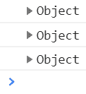
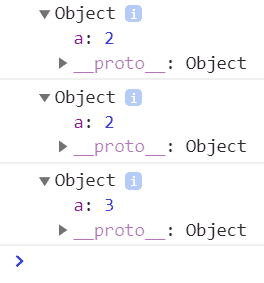
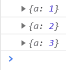
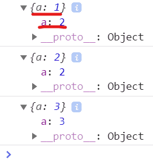
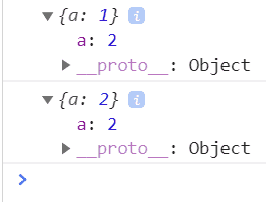
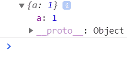
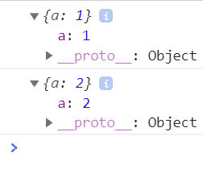
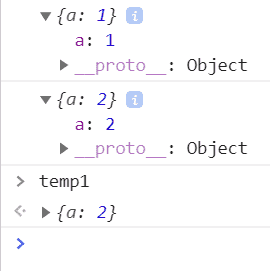
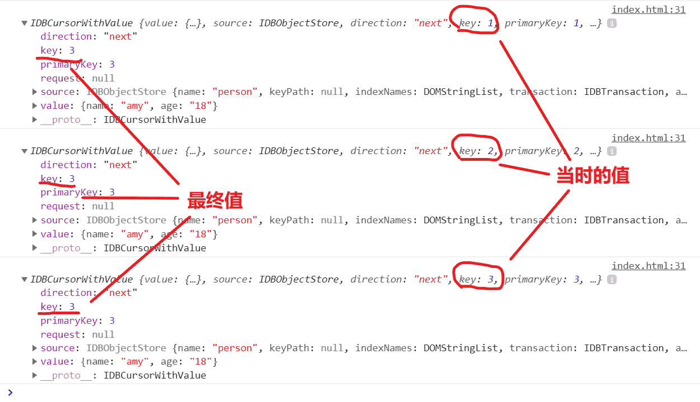

<h1>你懂console.log吗(浏览器控制台显示的小坑)</h1>

<!--more-->

## 初探

各位, 这个坑你可能真不知道! 先看一下下面的非常简单的代码, 你能预测出浏览器控制台的输出吗?
```js
let o = {a: 1};
console.log(o);
o.a = 2;
console.log(o);
o = {a: 3};
console.log(o);
```
打开这个测试网页, 再打开控制台看一下, 嗯, 就是这个样子:



展开看!



第三个的值和前两个不一样, 但是前两个的值是一样的! 也就是说, **某个地址上的对象, `console.log`的结果是当前的最终值**! 而第3个`o`, 由于`o`所指代的对象的地址变了, 所以不会对前两个有影响.

## 再探

不过你以为事情就这样结束了? nonono. 现在同样的代码, 我们先打开控制台, 按一下F5刷新, 看一下结果:



??? 为什么第一个显示的值又跟第二个不一样了? 别急, 我们打开看一下:



看来眼见不一定就是真实的啊. tm外面显示的是`{a: 1}`, 里面包了个`{a: 2}`, 厉不厉害! 这时其实只是显示问题, 前两个的真实值都是`{a: 2}`, 因为它们就是一个地址上的对象! 这说明**控制台的对象外层显示不会跟着刷新**.

## 再探

接下来我们更改下代码, 看看设置定时器会有什么结果!
```js
var a = {a: 1};
console.log(a);
setTimeout(function () {
    a.a = 2;
    console.log(a);
}, 5000);
```
嗯, 打开控制台, 按F5刷新, 等5秒钟, 这个结果跟前一个是一样的, 外层不刷新, 内层是真实值.



下面我们这么操作一下! 按F5刷新之后, 第一个值会在控制台上打印出来, 这时我们先把他打开, 此时定时器还没到时间, 其里面的值当然是这样:



5秒钟后, 第二个值也打印出来了. 你看第一个显示值的内层并没有跟着变成`{a: 2}`!



所以啊, **即使是控制台里的对象内层值, 它也可能不是真实的**! 和第2个结论合起来, 就是**你看到过的就不会变了**! 当然, 这两个显示值指代的是一个变量, 只不过是第一个显示值没更新而已. 我们可以在第一个显示对象上按右键, 选择`Storage as global variable`, 把它保存到当前的全局环境:



可以看到, 其实变量的真实值是`{a: 2}`, 只是显示没更新而已.

## 缘由

所以你还相信浏览器控制台里的输出吗? 这个问题我是在测试浏览器indexedDB的遍历方法时发现的, 当时的代码是这样的:
```js
let open = objectStore.openCursor();
open.onsuccess = function () {
    let cursor = open.result;
    if(cursor) {
        console.log(cursor);
        cursor.continue();
    }
}
```
里面的`cursor.continue()`会重复触发`success`事件. 由于每次`console.log()`中`cursor`的实际指向都是同一个对象, 所以`console.log()`会出现上面第2条中介绍的问题, 即所有显示值的内层都是`cursor`对象的**最终值**, 但是外层确是**当时**的`cursor`对象值. 注意下图中标注的部分:



## immutable

所以immutable是一个非常重要的方案, 对于console.log的显示问题有一个釜底抽薪的效果, 因为immutable方案的一个原则是:

一旦某个引用值被定义了, 那它的内容就不会变了!

变量被定义的时候, 内容就定格了, 所以只要变量没被释放, 无论后来什么时候console.log, 这个变量的内容就一定是不变的.