<style type="text/css" rel="stylesheet">
    /* body {
        padding: 0 10vw;
    }
    p {
        line-height: 2em;
        letter-spacing: 2px;
    }
    img {
        border: 1px solid grey;
        margin: 10px 0;
        max-width: 80vw;
        max-height: 100vw;
    }
    pre {
        background: #f2f2f2;
        padding: 10px;
    }
    blockquote {
        background: #f2f2f2;
        padding: 2px 10px;
        font-style: italic;
        margin: 0;
        border-radius: 10px;
    } */
</style>

<h1>React架构的进化</h1>

我希望通过4个版本的React, 来阐述React的原理, 优化思路和设计理念.

这4个版本并不代表实际的React演变之路, 只代表我对React的一个由浅入深的理解.

* v1: 关联视图和状态
* v2: 性能优化之vDOM和diff
* v3: 性能优化之Fiber
* v4: 编程范式和设计模式

## React v1 (关联视图和状态)

考虑到React的最基础的用法:

```jsx
class App extends Component {
    constructor(props) {
        super(props);
        this.state = { number: 0 };
    }

    add() {
        this.setState({ number: this.state.number + 1 });
    }

    render() {
        return (
            <div>
                current number: {this.state.number}
                <button onClick={this.add}>
                    click to add 1
                </button>
            </div>
        )
    }
}
render(<App />);
```

可以看到, React最初的设计思路就是: 隐藏调用DOM API的过程, 把view和state进行单向绑定, view是state的运算结果.

```
View = Function(State)
```

这实际上是一次命令式向声明式的转换, 提高了开发效率.

用过React的都知道, JSX是一种特殊的语法. 它并不符合JavaScript语法, 而是通过类似Babel的工具的编译, 会得到一个函数执行语句:

```
<div />  -->  createElement('div')
```

JSX的结果就取决于类似`createElement`这种函数的执行.

我们考虑最简单的情况, `createElement`函数返回的就是一个DOM树.

在这样的情况下, 每当state变动时, 只要重新调用render函数, 就可以获得最新的DOM树, 然后把这个DOM树挂载到页面DOM树中就可以了.

此时React只有**Renderer**这一部分.


> 对于JavaScript来说, 渲染指的是调用DOM API的步骤, 并不是指浏览器真正的渲染


图中的深蓝色元素为实际的变动元素, 然而其他的浅蓝色元素并未发生变动, 没有必要对它们进行更新.

所以, 这里有一个很大的问题, 把完整的新DOM树append到页面中, 会造成App组件下的所有DOM元素更新, 触发了大量不必要的回流和重绘.

> 一般认为, 浏览器的回流和重绘是非常消耗时间的行为, 这可能和JS引擎的行为, 即JavaScript对象模型与C++对象模型的转换有关.

React v1有着这样的缺陷, 那应该如何解决这个问题呢?

React团队给出的答案是: 使用vDOM和diff.

## React v2 (性能优化之vDOM和diff)

我们的React v2加入了一种数据结构--vDOM, 和一种算法--diff.

vDOM, 即virtual DOM(虚拟DOM), 就是一个JavaScript对象, 且可以互相之间组成vDOM树, 用来模拟实际的DOM树.

diff算法用来比对两个vDOM树, 找到真正的变化点.

vDOM + diff组成了React的一个新的部分: `Reconciler(协调器)`.

此时, React v2就有了2个组成部分, 如图.


### 为什么使用vDOM和diff

我在很多地方都看到过一种说法: 

"React使用vDOM和diff, 是因为这比直接操作DOM快." 我之前一直不理解这句话: React使用vDOM, 进行diff, 最终都还是要调用浏览器的DOM API, 在之前多做了很多事情, 肯定比直接调用浏览器的DOM API慢吧. 正数再小也不可能比0小.


那React为什么使用vDOM和diff?

在我看来, React使用diff的原因就是为了解决刚才所说的缺陷.

当state或props更新时, 会重新运行渲染函数得到一个新的vDOM树. 如果不使用diff, 那就只能把这个新的vDOM树(转换为DOM后)完整地append到页面DOM树中. 而这样的行为会触发大量的浏览器回流和重绘, 消耗大量的时间.

所以, 更好的方案是把旧vDOM和新vDOM进行比对, 然后确定变动的位置, 只在页面DOM中进行必要修改. JavaScript的运行比浏览器回流和重绘更快, 在加上设计一个合适的diff算法, 一定可以比不使用diff性能好.

相应地, 使用vDOM而不是使用DOM作为数据结构, 我觉得是因为vDOM更轻量, 我们不需要DOM这样一个完整的实现, 只需要保留并添加必须的部分就好.

> 另外, 使用vDOM作为一种数据结构, 也能更方便移植到不同的render平台上.
> Vue本身通过模板分析, proxy和发布订阅机制是能更好确定变动位置的, 本不必使用vDOM和diff, 而Vue使用vDOM和diff算法, 应该就是考量的可移植这一点

我们再来看下刚才那个说法. create vDOM + diff + render当然比单一render慢, 但问题是对于React的实现方式来说, 单一render只能重新render整个组件(更耗时), 并不能确定**哪里的DOM发生了真实改变**.

上面那句话这句话应该表述为: 使用diff算法确定实际的vDOM变动位置, 然后再针对性修改DOM, 比用整个新DOM替换掉整个旧DOM(触发大量回流和重绘)更快. 即: reconcile后针对性render, 比全部render性能好.

> 参考:

> <https://stackoverflow.com/questions/61245695/how-exactly-is-reacts-virtual-dom-faster>

> Different javascript frameworks take different approaches to detect changes in the data model and render them on the view.

> React takes a different approach. Whenever there is a state change in a React component, instead of finding out where to make the changes (like AngularJS), React re-renders the entire UI from scratch (with the updated state).

> But this approach of React has a problem. To re-render the entire UI means to re-render the entire DOM tree. This is a problem because DOM updation is a slow process (due to reflow and repainting).

### vDOM树的结构

vDOM就是一个JavaScript对象, 简化的vDOM结构如下:
* vDOM
  * type. 含义, vDOM类型; 值, Fragment函数 / Component函数 / 'div'这样的字符串 / null
  * _parent. 含义, 父vDOM节点
  * _children. 含义, 所有的子vDOM节点
  * _dom. 含义, 该vDOM节点对应的实际DOM节点
  * key. 含义, 本vDOM相对于兄弟vDOM的唯一标识
  * props. 含义, 即props, 包含children, HTML attributes, Component props等

* type不同值的含义
  * type == Fragment函数, 则这是个Fragment节点, `<></>`
  * type == Component函数, 则这是个Component节点, `<App />`
  * type == 'div', 则这是个div节点, `<div />`
  * type == null, 则这是个文本节点, `text`

比如, 有下面这个JSX:

```jsx
<App>
    <div>
        <br />
        text
    <div>
</App>
```

首先通过createElement函数, 会填充type, key和props, 而_parent, _children和_dom都是在diff时赋值的. 我们先不关注具体的diff过程, 先来看一下vDOM树的静态结构.


vDOM树由vDOM通过_parent和_children组合而成, 且叶子节点为文本节点或者null.

### Preact的diff算法简述

React代码比较庞大和繁杂, 我通过分析另外一个类似的库--Preact的源码, 可以发现Preact的diff算法有以下几个函数:

* diff, 作用主要为处理组件, 执行组件的render函数获得组件vDOM, 并负责执行组件的生命周期函数
* diffChildren, 作用主要为生成新的vDOM节点, 把diffElementNodes生成的新DOM挂载到父DOM上, 并卸载过期DOM
* diffElementNodes, 作用主要为生成新的DOM节点
* diffProps, 作用主要为更新DOM节点的attributes

每一次diff过程都是从diff算法中的`diff()`函数开始的, diff算法的调用时机有两个:
* 调用`render`时, 这是第一次调用`diff()`, 初始化vDOM树
* state发生变更时, 即调用setState方法时调用`diff()`, 更新vDOM树

接下来以以下代码为例, 详细解释diff算法的流程.
```jsx
class App extends Component {
    state = { number: 0 }

    add() {
        this.setState({ number: this.state.number + 1 })
    }

    render() {
        return (
            <div>
                current number: {this.state.number}
                {
                    this.state.number % 2 === 1 ?
                    <span>, it's an odd number</span>
                    : <br />
                }
                <button onClick={this.add}>click to add 1</button>
            </div>
        );
    }
}

render(createElement(App), document.getElementById('root'));
```

### Preact的diff算法详述 - 函数调用顺序

上面函数中, diffProps是由diffElementNodes完全调用的, 我们可以认为它是diffElementNodes的一部分.

当节点`type == null`, 即节点为文本节点时, diffChildren会调用diff函数, 但是diff函数对文本节点的处理很薄, 之后diff函数把文本节点的真正处理交给了diffElementNodes, 我们在此可以认为, diffChildren直接调用了diffElementNodes函数.

在上面两个假设的前提下, 对于上面的代码, vDOM的diff顺序如下:


可以看出Preact的diff算法是递归调用的, 由递归diff算法组成的Reconciler也被称为`Stack Reconciler(栈协调器)`.

既然被称为"栈协调器", 那我们来画一个"栈", 用图示的方法展示完整的diff过程.

### Preact的diff算法详述 - 初始化时调用栈

vDOM树的初始化, 详细流程如下:



### Preact的diff算法详述 - 更新

仅展示更新时的`diffChildren div`从入栈到出栈的阶段, 这是变化的重点部分, 详细流程如下:



## React v3 (性能优化之Fiber)

React v3中Reconciler被改造, 由`Stack Reconciler`改造为`Fiber Reconciler`.

此外, React v3还加入了`Scheduler`, 也称`Fiber Scheduler`.

这两部分会在下面详细展开, 此时React的结构如图:


### 解决diff耗时过长的问题

我们的React每进行一版更新, 都是为了解决某一个问题的.

React v2的更新解决了组件内所有DOM元素全部回流和重绘的耗时问题, 实现了"只改变实际变动的DOM".

然而React v2并不是完美的, 它存在DOM元素较多时的渲染卡顿问题.

考虑到浏览器的event loop:


由于React v2中, diff过程为递归调用. 在es5中, 一旦函数开始执行, 就无法停下, 直到结束或发生错误.

如果DOM元素过多, 那么diff过程的耗时就会过长, 导致这一次的event loop耗时过长, 延迟了重绘的时机, 这就会体现为:

* 用户事件得不到响应
* 页面卡顿


所以, 为了不拖延每一次的event loop, React的diff运算必须是可中断的.

如果一次event loop内diff过程没有完成, 那它必须中断, 等待下一次有时间的时候执行.

在es6中, 新特性`Generator`, 可以实现对函数执行的中断和恢复.

然而React并未使用Generator拆分diff过程, 主要是因为Generator一方面无法实现状态的回退和跳转, 只能按照顺序逐一进行, 另一方面Generator有传染性, 对代码改造起来较为麻烦.

> 详细原因可以参考: <https://github.com/facebook/react/issues/7942#issuecomment-254987818>

其实我们希望的是设计一种机制, 可以**根据优先级协调**不同**任务片段**的执行.

React实现这一机制的模型就是**Fiber**.

Fiber模型分为两部分, 一部分是Fiber Reconciler, 即任务片段, 主要包含diff过程.

另一部分是Fiber Scheduler, 即调度器, 负责根据优先级不同调度任务片段的执行.

### Fiber Reconciler

和Stack Reconciler相比, Fiber Reconciler最大的不同是**可拆分**.

对原有的递归函数使用Generator进行中断, 无法满足要求. 那另外一个思路就是, 能否把大的diff递归过程拆分为一个个小函数执行过程, 在每一个小过程前检查是否存在空闲时间, 如果存在空闲时间再执行这一小过程.

这就是Fiber Reconciler的解决问题的思路.

如何把大递归调用拆分为一个一个的小过程, 可以看下图:


此即Fiber的核心解决办法, 本质上是数据结构的变更, 遍历vDOM树的方式**由栈变更为链表**, 而链表是完全可拆分的.

和之前的vDOM节点比, Fiber vDOM节点增加了`_sibling`, 即指向兄弟节点的部分.

虽然抛弃了递归的diff方法, Fiber vDOM Tree遍历也存在"递"和"归".

用文字描述图中的调用顺序即为:
* 如果节点存在未diff的子节点, 则"递"diff它的长子节点
* 如果节点不存在未diff的子节点, 但存在未diff的兄弟节点, 则"递"diff它的兄弟节点
* 如果节点不存在未diff的子节点和兄弟节点, 则"归"diff它的父节点

### Fiber Scheduler

施工中...

(最小的回流和重绘次数)

## React v4 (编程范式和设计模式)

施工中...

(组合|继承 是"概念" 区别为 has a | is a)

(编程语言 -- 编程范式 -- 概念)
(programming laguage -- programming paradigm -- concept)
()

(JavaScript具备3种编程范式)

(原型链是属于面向对象编程范式的)

(可以认为, 上古DOM操作是属于面向过程, 更命令式; React融合了面向对象和函数式, 更声明式)

(React的趋势是抛弃面向对象, 拥抱函数式, 变得更加抽象, 更加易用)

(React类组件是面向对象, 函数式组件是函数式)

(React组件复用方法中, HOC既有函数式的组合实现方式--属性代理, 也有面向对象的继承实现方式--反向继承, hooks则是函数式的组合实现方式)

