<h1>React架构的进化</h1>

我希望通过4个版本的React, 来阐述React的原理, 优化思路和设计理念.

这4个版本并不代表实际的React演变之路, 只代表我对React的一个由浅入深的理解.

* v1: 声明式开发
* v2: 性能优化之vDOM和diff
* v3: 性能优化之Fiber
* v4: 编程范式和设计模式

## React v1 (声明式开发)

考虑到React的最基础的用法:

```jsx
class App extends Component {
    constructor(props) {
        super(props);
        this.state = { number: 0 };
    }

    add() {
        this.setState({ number: this.state.number + 1 });
    }

    render() {
        return (
            <div>
                current number: {this.state.number}
                <button onClick={this.add}>
                    click to add 1
                </button>
            </div>
        )
    }
}
render(<App />);
```

可以看到, React最初的设计思路就是: 隐藏调用DOM API的过程, 把view和state进行单向绑定, view是state的运算结果.

```
View = Function(State)
```

这实际上是一次**命令式向声明式的转换, 提高了开发效率**.

用过React的都知道, JSX是一种特殊的语法. 它并不符合JavaScript语法, 而是通过类似Babel的工具的编译, 会得到一个函数执行语句:

```
<div />  -->  createElement('div')
```

JSX的结果就取决于类似`createElement`这种函数的执行.

我们考虑最简单的情况, `createElement`函数返回的就是一个DOM树.

在这样的情况下, 每当state变动时, 只要重新调用render函数, 就可以获得最新的DOM树, 然后把这个DOM树挂载到页面DOM树中就可以了.

此时React只有**Renderer**这一部分.


> 对于JavaScript来说, 渲染指的是调用DOM API的步骤, 并不是指浏览器真正的渲染


图中的深蓝色元素为实际的变动元素, 然而其他的浅蓝色元素并未发生变动, 没有必要对它们进行更新.

所以, 这里有一个很大的问题, 把完整的新DOM树append到页面中, 会造成App组件下的所有DOM元素更新, 触发了大量不必要的回流和重绘.

> 一般认为, 浏览器的回流和重绘是非常消耗时间的行为, 这可能和JS引擎的行为, 即JavaScript对象模型与C++对象模型的转换有关.

React v1有着这样的缺陷, 那应该如何解决这个问题呢?

React团队给出的答案是: 使用vDOM和diff.

## React v2 (性能优化之vDOM和diff)

我们的React v2加入了一种数据结构--vDOM, 和一种算法--diff.

vDOM, 即virtual DOM(虚拟DOM), 就是一个JavaScript对象, 且可以互相之间组成vDOM树, 用来模拟实际的DOM树.

diff算法用来比对两个vDOM树, 找到真正的变化点.

vDOM + diff组成了React的一个新的部分: `Reconciler(协调器)`.

此时, React v2就有了2个组成部分, 如图.


### 为什么使用vDOM和diff

我在很多地方都看到过一种说法: 

"React使用vDOM和diff, 是因为这比直接操作DOM快." 我之前一直不理解这句话: React使用vDOM, 进行diff, 最终都还是要调用浏览器的DOM API, 在之前多做了很多事情, 肯定比直接调用浏览器的DOM API慢吧. 正数再小也不可能比0小.


那React为什么使用vDOM和diff?

在我看来, React使用diff的原因就是为了解决刚才所说的缺陷.

当state或props更新时, 会重新运行渲染函数得到一个新的vDOM树. 如果不使用diff, 那就只能把这个新的vDOM树(转换为DOM后)完整地append到页面DOM树中. 而这样的行为会触发大量的浏览器回流和重绘, 消耗大量的时间.

所以, 更好的方案是把旧vDOM和新vDOM进行比对, 然后确定变动的位置, 只在页面DOM中进行必要修改. JavaScript的运行比浏览器回流和重绘更快, 在加上设计一个合适的diff算法, 一定可以比不使用diff性能好.

相应地, 使用vDOM而不是使用DOM作为数据结构, 我觉得是因为vDOM更轻量, 我们不需要DOM这样一个完整的实现, 只需要保留并添加必须的部分就好.

> 另外, 使用vDOM作为一种数据结构, 也能更方便移植到不同的render平台上.
> Vue本身通过模板分析, proxy和发布订阅机制是能更好确定变动位置的, 本不必使用vDOM和diff, 而Vue使用vDOM和diff算法, 考量的就有可移植这一点

我们再来看下刚才那个说法. create vDOM + diff + render当然比单一render慢, 但问题是对于React的实现方式来说, 单一render只能重新render整个组件(更耗时), 并不能确定**哪里的DOM发生了真实改变**.

上面那句话这句话应该表述为: 使用diff算法确定实际的vDOM变动位置, 然后再针对性修改DOM, 比用整个新DOM替换掉整个旧DOM(触发大量回流和重绘)更快. 即: reconcile后针对性render, 比全部render性能好.

> 参考:

> <https://stackoverflow.com/questions/61245695/how-exactly-is-reacts-virtual-dom-faster>

> Different javascript frameworks take different approaches to detect changes in the data model and render them on the view.

> React takes a different approach. Whenever there is a state change in a React component, instead of finding out where to make the changes (like AngularJS), React re-renders the entire UI from scratch (with the updated state).

> But this approach of React has a problem. To re-render the entire UI means to re-render the entire DOM tree. This is a problem because DOM updation is a slow process (due to reflow and repainting).

### vDOM树的结构

vDOM就是一个JavaScript对象, 简化的vDOM结构如下:
* vDOM
  * type. 含义, vDOM类型; 值, Fragment函数 / Component函数 / 'div'这样的字符串 / null
  * _parent. 含义, 父vDOM节点
  * _children. 含义, 所有的子vDOM节点
  * _dom. 含义, 该vDOM节点对应的实际DOM节点
  * key. 含义, 本vDOM相对于兄弟vDOM的唯一标识
  * props. 含义, 即props, 包含children, HTML attributes, Component props等

* type不同值的含义
  * type == Fragment函数, 则这是个Fragment节点, `<></>`
  * type == Component函数, 则这是个Component节点, `<App />`
  * type == 'div', 则这是个div节点, `<div />`
  * type == null, 则这是个文本节点, `text`

比如, 有下面这个JSX:

```jsx
<App>
    <div>
        <br />
        text
    <div>
</App>
```

首先通过createElement函数, 会填充type, key和props, 而_parent, _children和_dom都是在diff时赋值的. 我们先不关注具体的diff过程, 先来看一下vDOM树的静态结构.



vDOM树由vDOM通过_parent和_children组合而成, 且叶子节点为文本节点或者null.

### Preact的diff算法简述

React代码比较庞大和繁杂, 我通过分析另外一个类似的库--Preact的源码, 可以发现Preact的diff算法有以下几个函数:

* diff, 作用主要为处理组件, 执行组件的render函数获得组件vDOM, 并负责执行组件的生命周期函数
* diffChildren, 作用主要为生成新的vDOM节点, 把diffElementNodes生成的新DOM挂载到父DOM上, 并卸载过期DOM
* diffElementNodes, 作用主要为生成新的DOM节点
* diffProps, 作用主要为更新DOM节点的attributes

每一次diff过程都是从diff算法中的`diff()`函数开始的, diff算法的调用时机有两个:
* 调用`render`时, 这是第一次调用`diff()`, 初始化vDOM树
* state发生变更时, 即调用setState方法时调用`diff()`, 更新vDOM树

接下来以以下代码为例, 详细解释diff算法的流程.
```jsx
class App extends Component {
    state = { number: 0 }

    add() {
        this.setState({ number: this.state.number + 1 })
    }

    render() {
        return (
            <div>
                current number: {this.state.number}
                {
                    this.state.number % 2 === 1 ?
                    <span>, it's an odd number</span>
                    : <br />
                }
                <button onClick={this.add}>click to add 1</button>
            </div>
        );
    }
}

render(createElement(App), document.getElementById('root'));
```

### Preact的diff算法详述 - 函数调用顺序

上面函数中, diffProps是由diffElementNodes完全调用的, 我们可以认为它是diffElementNodes的一部分.

当节点`type == null`, 即节点为文本节点时, diffChildren会调用diff函数, 但是diff函数对文本节点的处理很薄, 之后diff函数把文本节点的真正处理交给了diffElementNodes, 我们在此可以认为, diffChildren直接调用了diffElementNodes函数.

在上面两个假设的前提下, 对于上面的代码, vDOM的diff顺序如下:


可以看出Preact的diff算法是递归调用的, 由递归diff算法组成的Reconciler也被称为`Stack Reconciler(栈协调器)`.

既然被称为"栈协调器", 那我们来画一个"栈", 用图示的方法展示完整的diff过程.

### Preact的diff算法详述 - 初始化时调用栈

vDOM树的初始化, 详细流程如下:


### Preact的diff算法详述 - 更新

仅展示更新时的`diffChildren div`从入栈到出栈的阶段, 这是变化的重点部分, 详细流程如下:


## React v3 (性能优化之Fiber)

React v3中Reconciler被改造, 由`Stack Reconciler`改造为`Fiber Reconciler`.

此外, React v3还加入了`Scheduler`, 也称`Fiber Scheduler`.

这两部分会在下面详细展开, 此时React的结构如图:


### 解决diff耗时过长的问题

我们的React每进行一版更新, 都是为了解决某一个问题的.

React v2的更新解决了组件内所有DOM元素全部回流和重绘的耗时问题, 实现了"只改变实际变动的DOM".

然而React v2并不是完美的, 它存在DOM元素较多时的渲染卡顿问题.

考虑到浏览器的event loop:



由于React v2中, diff过程为递归调用. 在es5中, 一旦函数开始执行, 就无法停下, 直到结束或发生错误.

如果DOM元素过多, 那么diff过程的耗时就会过长, 导致这一次的event loop耗时过长, 延迟了重绘的时机, 这就会体现为:

* 用户事件得不到响应
* 页面卡顿


所以, 为了不拖延每一次的event loop, React的diff运算必须是可中断的.

如果一次event loop内diff过程没有完成, 那它必须中断, 等待下一次有时间的时候执行.

在es6中, 新特性`Generator`, 可以实现对函数执行的中断和恢复.

然而React并未使用Generator拆分diff过程, 主要是因为Generator一方面无法实现状态的回退和跳转, 只能按照顺序逐一进行, 另一方面Generator有传染性, 对代码改造起来较为麻烦.

> 详细原因可以参考: <https://github.com/facebook/react/issues/7942#issuecomment-254987818>

其实我们希望的是设计一种机制, 可以**根据优先级协调**不同**任务片段**的执行.

React实现这一机制的模型就是**Fiber**.

Fiber模型分为两部分, 一部分是Fiber Reconciler, 即任务片段, 主要包含diff过程.

另一部分是Fiber Scheduler, 即调度器, 负责根据优先级不同调度任务片段的执行.

### Fiber Reconciler

和Stack Reconciler相比, Fiber Reconciler最大的不同是**可拆分**.

对原有的递归函数使用Generator进行中断, 无法满足要求. 那另外一个思路就是, 能否把大的diff递归过程拆分为一个个小函数执行过程, 在每一个小过程前检查是否存在空闲时间, 如果存在空闲时间再执行这一小过程.

这就是Fiber Reconciler的解决问题的思路.

如何把大递归调用拆分为一个一个的小过程, 可以看下图:


此即Fiber的核心解决办法, 本质上是数据结构的变更, 遍历vDOM树的方式**由栈变更为链表**, 而链表是完全可拆分的.

和之前的vDOM节点比, Fiber vDOM节点增加了`_sibling`, 即指向兄弟节点的部分.

虽然抛弃了递归的diff方法, Fiber vDOM Tree遍历也存在"递"和"归".

用文字描述图中的调用顺序即为:
* 如果节点存在未diff的子节点, 则"递"diff它的长子节点
* 如果节点不存在未diff的子节点, 但存在未diff的兄弟节点, 则"递"diff它的兄弟节点
* 如果节点不存在未diff的子节点和兄弟节点, 则"归"diff它的父节点

### Fiber Scheduler

施工中...

(最小的回流和重绘次数)

## React v4 (函数式编程)

### 函数式编程简介

施工中...
### Preact函数式组件和hooks实现原理

在介绍函数式组件实现原理之前, 我们先来看下Preact的类组件的渲染过程:



在第一次渲染调用Preact.render, 和调用component.setState时, 都会调用diff函数.

在diff函数内, 依次执行diff前的生命周期函数(如componentWillMount, componentWillReceiveProps), component.render方法, diffChildren.

之后, 会执行所有diff完成的回调函数, 包括diff后的生命周期函数(如componentDidMount, componentDidUpdate).

如果diffChildren过程发现了不再需要渲染的节点, 会执行unmount过程, 并在真正卸载节点之前执行componentWillUnmount.

再之后, 本次event loop的js执行结束, 进行回流和重绘. 在下次触发状态更新时, 再次触发此流程.

对于函数式组件来说, 我们通过几个问题来看一下是怎么处理的:

**问题1, 函数本身是如何保存状态, 以进行diff的?**

Preact渲染过程存在diff, 必然需要保存每个节点上一次的状态. 由于函数本身并不会保存状态, 所以对于函数式组件, 首先会将其转换成类组件, 用类组件实例化为对象, 才能保存状态, 正常参与diff过程.

而函数式组件转换成类组件, 思路是这样的: 把函数作为类组件的render方法. 这样, 每次渲染时都会重新执行函数, 获得最新的vDOM树.

```js
function FunComponent() {
    // ***
}
// convert to
class ClassComponent {
    render() {
        return FunComponent(this.props);
    }
}
```

**问题2, 函数式组件的hooks状态, 是如何存储在对应的对象实例里的?**

函数式组件内如果存在hooks, 则组件会被打上`__hooks`标记. 函数式组件的相关状态就存储于`component.__hooks`, 另外函数式组件渲染过程还涉及到`_renderCallbacks`字段:

```js
component = {
    __hooks: {
        _list: [],
        _pendingEffects: [],
    },
    _renderCallbacks: [],
    // ...其他
}
```

每个字段的含义为:

* `_list`内按顺序存储了组件内的每一个hook状态, 这部分会在下面各hooks的实现原理里面详细说
* `_pendingEffects`内存储的是本次渲染完成后, 需要执行的回调函数.
* `_renderCallbacks`内存储的是本次渲染的diff完成后执行的回调函数. setState的回调函数, componentDidMount和componentDidUpdate都是放在这里面的, 函数式组件渲染时也会往这里面追加包含回调函数的hooks

> `_pendingEffects`和`_renderCallbacks`都保存有包含回调函数的hooks, 但是他们的执行时机不同

**问题3, 函数式组件产生的状态是如何参与渲染过程的?**

函数式组件被实例化成vDOM, 也会参与上面的所有渲染过程. 渲染过程中, 和类组件的不同是, 函数式组件并不存在生命周期函数, 而是存在hooks.

Preact在渲染过程中插入了几个函数式组件的"生命周期函数", 用来在不同的时机执行hooks.



* _diff和_render
  * 设置`currentComponent`为当前组件, 代表diff开始
  * 重置`currentIndex`为0, 重新开始对hooks计数
* diffed
  * 使用setTimeout插入宏任务, 执行`_pendingEffects`内每个hook的上轮清空函数和本轮回调函数
  * 将`currentComponent`重置为null, 代表组件diff完成
* _commit, 执行`_renderCallbacks`内每个hook的上轮清空函数和本轮回调函数
* unmount, 执行所有hook的上轮清空函数

函数式组件的"生命周期函数"会处理`__hooks`, 进行专门针对函数式组件的操作. 如果组件实例上不存在`__hooks`, 那么这些"生命周期函数"实际上什么也没做, 不会影响原本的类组件的渲染过程.

**问题4, 函数式组件里的hooks是如何进行标识的, 为什么hooks必须执行, 而不能处在条件语句内或被return语句短路掉?**

函数式组件在执行时, 会通过`currentIndex`对函数式组件内的hooks进行排序, 按照顺序保存每个hook的上一次的状态, 比如上一次的state, 上一次的清空函数等.

所以, 在每次函数式组件的函数重新运行的时候, 所有hooks必须**按照顺序且一个不落**的运行一遍, 这样才能对应起每个hook的每一次变更. 如果将hooks放置于选择性执行的代码中, 那么这个顺序就会乱掉, 就无法正常diff和渲染了.

### Preact各hooks的实现原理

**useReducer**

reducer本质上是下面这样一个函数:

```js
function reducer(state, action) {
	test(action);
    return modify(state);
}
```

dispatch本质上是下面这样一个函数:

```js
function dispatch(action) {
    reducer(lastState, action);
}
```

一句话总结: reducer根据action对state进行修改, dispatch使用接收到的action在内部调用reducer.

useReducer的hook状态格式如下:

```js
{
    _reducer,
    _value,
    _component
}
```

在第一次调用useReducer时, 会进行下列操作:

```js
function useReducer(reducer, initialState) {
    hookState._reducer = reducer;
    hookState._value = [
        initialState,
        action => {
            newState = hookState._reducer(hookState._value[0], action);
            if(newState !== hookState._value[0]) {
                hookState._value[0] = newState;
                hookState._component.setState({});
            }
        }
    ];
    hookState._component = currentComponent;
}
```

_value即为useReducer函数的返回值, 第0项为当前的state, 第1项为dispatch函数. reducer函数需要用户定义并传入, dispatch函数则是由Preact内部实现.

实际调用dispatch函数时, 会根据dispatch接收到的action, 并以上一次state为参照, 执行reducer函数.

然后, 会进行新旧state的比对, 如果发生了变化, 则更新状态, 并使用component.setState重新启动渲染过程.

**useState**

useState是使用useReducer实现的, 本质上, useState是一个简化版useReducer.

对应于reducer, useState存在`invokeOrReturn`函数:

```js
function invokeOrReturn(arg, f) {
	return typeof f == 'function' ? f(arg) : f;
}
```

对应于dispatch, useState的第二个返回值是常用的`setSomeState`函数:
```js
function setSomeState(f) {
    invokeOrReturn(lastState, f)
}
```

和useReducer不同, useState的invokeOrReturn和setSomeState函数都是由Preact内部定义的, 不需要用户传入, 这实际上简化了useReducer的使用, 对于大部分简单场景直接使用useState即可.

> 可以看到, 新旧state的比对是通过`!==`实现的, 所以在setSomeState的时候需要`setSomeState({ ...oldState, newValue })`才能触发UI变更

> 另一方面, 当状态没有发生变更, 而重复setSomeState时, 不会触发UI变更

> 由于invokeOrReturn函数的特性, 当设置函数状态时需要多嵌套一层: `setSomeState(() => anyFunction)`, 否则函数会在设置状态时被执行

**useEffect**

useEffect hook也是非常常用的, 它的hook状态格式如下:
```js
{
    _value,
    _args
}
```

_value存储了useEffect的第一个入参, 即回调函数; _args存储了useEffect的第二个入参, 即依赖状态.

useEffect的内部逻辑为:
```js
function useEffect(callback, args) {
    if (argsChanged(state._args, args)) {
        state._value = callback;
        state._args = args;

        currentComponent.__hooks._pendingEffects.push(state);
    }
}
```
如果依赖状态发生了变更, 则重新对hook状态赋值, 并将hook状态推入`_pendingEffects`.

上面的[Preact函数式组件和hooks实现原理](#preact函数式组件和hooks实现原理)的问题3里提到过, `_pendingEffects`内部的函数会被插入宏任务队列执行, 即在本轮渲染完成后执行.

**useLayoutEffect**

useLayoutEffect和useEffect基本一致, 区别在于useLayoutEffect内会将hook状态推入`_renderCallbacks`:

```js
function useLayoutEffect(callback, args) {
    if (argsChanged(state._args, args)) {
        state._value = callback;
        state._args = args;

        currentComponent._renderCallbacks.push(state);
    }
}
```

上面的[Preact函数式组件和hooks实现原理](#preact函数式组件和hooks实现原理)的问题3里提到过, `_renderCallbacks`内部的函数会在本轮diff后执行, 所以useLayoutEffect的效果和componentDidMount是一样的.

**useMemo**

useMemo非常简单, 可能是原理最简单的hook了, 它的hook状态格式如下:
```js
{
    _value,
    _args
}
```

实现代码:

```js
function useMemo(factory, args) {
    if (argsChanged(state._args, args)) {
        state._value = factory();
        state._args = args;
    }
    return state._value;
}
```

如果依赖状态发生了变更, 则重新运行factory函数, 获取最新的值.

**useCallback**

useCallback是用useMemo实现的:

```js
const useCallback = (callback, args) => useMemo(() => callback, args)
```

**useRef**

useRef是用useMemo实现的:

```js
const useRef = (initialValue) => useMemo(() => ({ current: initialValue }), [])
```

**useImperativeHandle**

> 看源码才知道有这样一个hook.

我们会通过props将值从父组件传递给子组件, 并通过props.someFunction将值从子组件传递给父组件. 而useImperativeHandle是另外一种将值从子组件传递给父组件的方式.

useImperativeHandle是通过useLayoutEffect实现的:

```js
function useImperativeHandle(ref, createHandle, args) {
    useLayoutEffect(
        () => {
            if (typeof ref == 'function') ref(createHandle());
            else if (ref) ref.current = createHandle();
        },
        args == null ? args : args.concat(ref)
    );
}
```
