<h1>关于程序结构和设计模式的思考</h1>

设计模式是代码结构设计经验的总结. 谈到设计模式, 不得不先说一下面向对象, 因为我们平时常说的设计模式, 是来自一本叫<设计模式>的书, 而这本书的全称叫做<设计模式：可复用面向对象软件的基础>. 从面向对象的程序设计说起, 我也会分析一下我所认为的良好的Web前端程序结构. 内容较散, 偏Web前端开发的经验性总结和"最佳实践".

## 关于面向对象的程序设计

我对面向对象的了解并不深入, 记得在大学里学习C++的时候, 面向对象有3大特性: 封装, 继承和多态, 这就是我对面向对象的基本印象了.

而从网络上搜索的资料来看, 对于面向对象这个概念的解释比较混乱, 也不乏批评的声音. 有的人解释面向对象为一种理念, 更多的人谈及的是面向对象的一些具体特点(基本是老三样: 封装, 继承和多态), 也有很多人在实际的语言层面解释面向对象. 不过可以确定的是, 面向对象是一种相对过时的理念, 有很多可取之处, 在发展中夹杂了很多教条和糟粕.

我并不想纠结关于面向对象的概念问题, 只是想从实际的程序架构设计和编码出发, 总结一下目前我觉得比较良好的编程结构.

## 好的程序结构设计

### 封装

我认为好的程序结构, 应该是以`封装`为前提的. 封装, 封装的是属性和方法, 比较典型的封装方法有类, 闭包等.

封装的关键是**隐藏内部细节, 并对外暴露接口**. 其实, 封装就是`模块化`的思想.

### 封装方法 -- 类

按照上面的说法, 我认为一个典型的封装体, 比如类, 内部应该有3类代码:
* 状态(私有属性, 由公共方法改变)
* 接口(公共方法, 其实构造函数也属于接口)
* 私有方法(由公共方法调用)

```ts
class A {
    private state = 0;
    public getState() {
        return this.deepCopy(this.state);
    }
    public setState(newState) {
        this.state = newState;
    }
    private deepCopy { ... }
}
const a = new A();
a.setState(1);
console.log(a.getState());
```

个人认为属性不应该是公共的, 访问属性应该通过相应的get接口. 这是因为需要保持`数据的不可变性`, 属性一旦暴露给外面, 就很难保证其不被篡改.

其实对于类来说, 这里的数据的不可变, 主要的含义是使数据的变化可控可预测, 不发生预测之外的篡改, 不是数据完全不变.

当然, 如果这个状态是一个引用类型的变量, 那么外部拿到这个引用类型变量时也是可以修改其内部数据的, 这就是数据可变性带来的弊端. 这时get接口可以返回一个状态的深拷贝来解决上面的问题.

典型的接口类型: "增", "删", "改", "查". 如果这个类的某个方法仅仅是处理输入数据然后返回, 没有任何其他依赖(即"纯函数"), 那这就不需要类了, 因为和函数相比, 类的区别就是保存了一套状态. 这时, 应该考虑把这个方法作为单独的函数.

由类构造对象, 这种方法下对象内的属性默认是可变的, 这和不可变数据思想相冲突, 因此类这种封装模式不太适合不可变数据思想.

### 封装方法 -- `immer.js`

在JavaScript里, 个人比较喜欢"immer.js"这个不可变数据库. 下面是`immer.js`封装的具体实现:

```ts
let a = produce({ state: 0 }); // 除非重新赋值, 否则a的值完全不变, a内的所有属性完全不变
a = produce(a, draft => draft.state = 1);
console.log(a.state);
```

这种方法下, 不用考虑数据可变性带来的副作用, 也不需要类里面那些冗余的get接口, 熟悉后应该会降低心智负担.

这是`函数式编程`中的一种全新的思路, 今后我个人编码时会尝试采用这种思路.

### 组合

曾不止一次看到或听到"组合优于继承", 个人也是这么认为的.

Web前端开发是我的"老本行", 在我使用React开发的过程中, 很少见到过继承思想. React组件复用本身就是一种组合的使用方法.

```tsx
import A from 'A';
const B = () => <A value={1}>;
```

所谓`组合`, 就是把封装好的各个模块按需组合. 模块化做到了功能分离, 使用组合的方法就可以把各功能有机结合起来, 且具备灵活性和配置性.

继承其本身也不是为了实现代码复用的, 而主要是为了接口统一的. 而为了实现接口统一, 只需要通过"implements"即可实现, 不一定需要"extends".

```ts
interface I {}
class A implements I {}
class B implements I {}
```

继承这种设计本身耦合性太强, 没有边界感, 个人目前不会优先使用继承的思想编码.

## 关于设计模式

关于设计模式, 其实很多设计模式在我看来是没有必要的.

首先这并不代表设计模式没有意义, 由于设计模式提出时间较早, 现在的各流行编程语言已经或多或少在语法层面上支持了一些设计模式理念, 所以这可能是导致很多设计模式在现在看起来比较繁琐无用的原因.

另一方面, 设计模式是教条面向对象思想下的一种比较固化的编码方式, 依赖很多面向对象的特点, 这些特点我个人不会用到, 更不用说相关的设计模式了.

除了上面提到的2种情况, 其他的设计模式中有一些会有一些"重复感".

在去除上面提到的一些因素之外, 我认为也有一些设计模式思想是非常有借鉴意义的. Web前端体系中有很多设计模式的思想, 只是之前我并没有强烈的认识到, 这些都是一种可以作为经验的通用型设计模式思想. 而对于不怎么熟悉的设计模式, 现在我已经对这些设计模式有了印象, 在之后经验多了以后可能就会认识到这些设计模式的重要性.

> 个人认为设计模式的一个作用就是固化代码写法, 使得一个比较大的团队的代码风格一致且可维护, 对于大型项目来说, 增加了其可扩充性和稳定性.

> 设计模式学习网站推荐: <https://refactoring.guru/>

## 部分设计模式分析

### 创建型设计模式

关于对象的创建, 首先个人认为一个对象的输入输出应该是明确的, 有边界的: **对象的输入应该仅有构造函数和接口两个途径**.

一个类的内部代码, 不应该引用除了构造函数和接口传入的其他外部变量(平台提供的能力除外).

功能模块的实例化也最好不要发生在另一个功能模块的实例化或方法执行过程中, 对象的实例化应该发生在主函数或一个统一的"导演类"中, 功能模块之间不应该有强关联.

```ts
const a = new A();
const b = new B();
const c = new C({ a });
c.bindInstanceB(b);
```

如果确实需要在类内部创建多个某类的对象, 可以把这个类传入:

```ts
const b = new B({ A });
```

### 组合模式

我一般把"组合"理解为上文[组合](#组合)部分, 这里的组合模式其实指的是"树状结构".

树状结构是一种典型的数据结构, React的vDOM树即为这种结构.

一般来说, 这种树状结构的每个节点的典型结构如下:

```ts
interface Node {
    parent: Node | null;
    children: Node[];
    value: any;
}
```

当然, 如果采用类封装, 在外部读取到Node的内容时, 需要通过get函数:

```ts
interface Node {
    parent: Node | null;
    children: Node[];
    value: any;
    getValue: () => any;
}
```

### 外观模式和代理模式

外观模式下存在两种类, 一种是实际执行操作的类(可称为"实际类"), 另一种是"外观类".

所谓外观类, 其作用为调用实际类对象上的方法, 并在调用这些方法的开始, 中间和结束时执行一些操作.

这不由得让人想起React的生命周期, 比如组件挂载后就会执行`componentDidMount`, 组件更新后就会执行`componentDidUpdate`.

```ts
class Facade {
    constructor(real: Real) {
        this.real = real;
    }
    operation() {
        console.log('start');
        this.real.operation();
        console.log('stop');
    }
}
class Real {
    operation() {
        console.log('real');
    }
}
(new Facade(new Real())).operation();
```

代理模式下也存在两种类, 除了实际类, 还存在"代理类".

所谓代理类, 其作用为确认相应的条件, 如果条件达到则调用实际类对象的方法.

```ts
class Proxy {
    constructor(real: Real) {
        this.real = real;
    }
    operation() {
        if(this.test()) this.real.operation();
    }
    test() {
        return true;
    }
}
class Real {
    operation() {
        console.log('real');
    }
}
(new Proxy(new Real())).operation();
```

这里把外观模式和代理模式一起说, 是因为这两种模式都是在调用实际类时增加一些操作, 有一定的相似性.

### 享元模式

所谓享元模式, 就是共用内存, 不重复创建相同的内容.

对于可变数据来说, 数据共享很有可能使数据被篡改, 这是一个需要注意的问题.

说到享元模式, 我想到了Immer.js这个不可变数据库, 它也使用到了共用内存, 且freeze住了变量, 也保证了共享数据无法篡改.

```ts
// data0, data1和data2都是引用类型的数据
const a = produce({x: data0, y: data1}, () => {});
const b = produce(a, (draft) => {
    draft.x = data2;
});
```

其内存共享情况如图:



### 观察者模式

观察者模式, 也叫发布订阅模式, 可能是我最早接触到的设计模式了. Vue中的监听数据变动并更新视图的思路, 和观察者模式就是相同的.

不使用类实现观察者模式的代码如下:

```ts
interface Store {
    [name: string]: () => void;
}

const subscribe = (store: Store, id: string, fn: () => void) =>
    (store[id] = fn);
const unSubscribe = (store: Store, id: string) => delete store[id];
const publish = (store: Store) =>
    Object.keys(store).forEach((key) => store[key]());

const log1 = () => console.log(1);
const logNum = (num: number) => console.log(num);

let store: Store = {};
subscribe(store, '1', log1);
subscribe(store, '2', () => logNum(2));
unSubscribe(store, '1');

publish(store);
```

### 备忘录模式

备忘录模式实际上是状态管理, 包括状态显示, 状态追加, 状态回溯等.

不使用类实现备忘录模式的代码如下:

```ts
interface Data {
    value: number;
}
const createData = (value: number): Data => ({ value });

const append = (store: Data[], data: Data) => [...store, data];
const getCurrent = (store: Data[]) => store[store.length - 1];
const undo = (store: Data[]): Data[] => [...store.slice(0, -1)];

let store: Data[] = [];
const data1 = createData(1);
const data2 = createData(2);

store = append(store, data1);
console.log(getCurrent(store).value);
store = append(store, data2);
console.log(getCurrent(store).value);
store = undo(store);
console.log(getCurrent(store).value);
```

### 模板模式

个人认为模板模式是多态的正宗用法: 抽象类中组织调用具体方法的顺序, 继承类中实现不同的具体方法.

不使用类, 实现类似模板模式的思路, 大概是这样的:

```ts
type Type = 'type1' | 'type2';

type Table = {
    [step: string]: Methods;
}

type Methods = {
    [type in Type]: () => any;
};

const table: Table = {
    init: { type1: () => {}, type2: () => {} },
    calculate: { type1: () => {}, type2: () => {} },
    end: { type1: () => {}, type2: () => {} },
};

const template = (type: Type) => {
    table.init[type]();
    table.calculate[type]();
    table.end[type]();
};
```