<h1>AI Flow开发工具设计</h1>

最近`Vibe Coding(氛围编程)`这个概念特别火, 很多人都在使用例如Bolt, Cursor之类的工具进行编程, 这极大提高了编程效率. 在编写小型应用时, 大模型能够发挥强大的局部代码生成能力. 然而当应用规模变大, 应用逻辑变复杂之后, 受限于大模型的能力, 还无法方便地`Vibe Coding`.

个人认为, 需要一款全新的工具, 创建合适的Vibe(氛围), 使开发者**高效**, **可靠**地使用大模型编写复杂应用.

## AI Flow开发工具的核心设计思路

首先, 在这里用一段简短的话, 概括AI Flow开发工具的核心设计思路:

**以分功能和分种类的思维拆分模块, 在大模型的帮助下进行模块实现和模块组装, 并且借助于流程图的组织性和直观性, 确保人能较快理清和掌控各个模块和流程**.

上面为一段概述, 观点可能并不新颖, 但是关键是是否有一套可行的具体方案.

## 现有开发和维护模式的问题分析

在阐述具体的功能和实现方式之前, 我们先来分析现有的开发和维护模式存在哪些问题.

### 使用大模型编码的问题

* 大模型上下文窗口有限制
* 大模型无法处理好复杂的业务逻辑
* 大模型幻觉, 代码是否正确并不好验证

只要使用过相关的开发工具, 想必对这些问题都有一定的感触. 这些问题证明了**大模型的能力边界**: 大模型擅长文本编写, 并不擅长复杂的逻辑编排; 大模型擅长做局部的代码新增, 不擅长在复杂的代码里修修改改.

### 真的只是受限于大模型吗

其实我们需要把视角从大模型这边移开, 既然明确了大模型的能力边界, 如果纯文本编码开发的方式和大模型不能更好的兼容, 这是不是可以说明:

1. **纯文本编码开发方式并不能完全适配大模型**, 需要一种新的开发方式, 去兼容, 去最大程度释放大模型能力
2. 另一方面, **纯文本编码也不方便开发者去检查和审核**, 除非对代码进行详细审查, 否则对于大模型的错误无能为力

### 纯文本表达方式的问题

虽然纯文本表达能力强, 表达成本低, 但是存在以下问题:

* 文本的**组织能力差**, 本质上是一种一维的表达方式, 不方便规范化, 模块和模块之间的关系不直观
* 文本的**理解成本高**, 想理清一段代码(尤其是命令式的逻辑代码)需要花费很大精力
* 文本之间通过目录(树状结构)连接, 这**并不能完全体现代码之间的关系**, 因为代码并非文章, 而是有更复杂和严谨的逻辑关系

文本是应用开发的表达媒介, 然而应用开发需要将不同模块严谨地组织起来, 也需要降低维护和理解门槛(无论是对其他开发者还是本人日后维护). 即使大模型能够去生成复杂应用的代码, 那对于这一堆文本代码, 开发者需要花费很大的精力去检查代码是否符合预期, 去排查发现的问题.

### 应用开发的"三高"

应用开发中存在很多的心智负担, 主要体现为应用开发的"三高", 即开发成本高, 调试成本高, 测试成本高. **很多当前的工作原则上并不合理**, 即使这是大家习以为常的.

#### 开发成本高

为了方便后续的维护, 开发阶段应该包含"应用描述"(如产品文档)和"应用编码"两部分的产出, 将应用描述翻译为应用编码, 涉及到模块拆分和转译代码, 这是一项很大的开发成本.

理想的开发方式是, 使用大模型**低成本**和**高参与**的进行模块拆分和转译代码.

#### 调试成本高

在需要理清代码逻辑或解Bug时, 我们往往需要打断点调试或打日志调试.

如果系统**天然具备便捷的调试能力**, 就不需要提前打断点或打日志这些工作.

#### 测试成本高

现在很多系统设计有较强的耦合性, 没有拆分成为可维护的模块, 且不具备针对模块的测试. 另外, 很多时候大家不会太重视测试工作, 这个很大程度上是因为编写测试代码是一项很费劲的工作.

因此理想的测试方式是, **模块测试和代码模块收敛到一起**, 且能一定程度**自动地描述和执行测试流程**.

### 应用的运维成本

在应用上线后, 还有很多的运维工作要做, 比如异常监控, 流量监控, 日志分析等. 在我看来, 这些运维工作, 无论是为了故障发现, 还是产品分析, 本质上是一类工作, 在技术实现上是一码事.

应用的运维, 其实类似于调试和测试步骤, 都是侧重于观察代码的执行结果. 这两种行为的主要区别, 主要表现为一个是线上一个是线下, 线上是真实数据, 侧重用户行为分析, 线下是mock数据, 侧重功能正确无误.

**内聚的系统最高效**. 由于大模型会简化很多事情, 并考虑到调试, 测试和运维, 本质上是一码事, 因此将这些功能全部收敛到一个系统内, 可以避免因功能分散到多个系统, 而导致的**对接, 权限管理, 学习成本和重复建设等问题**.

### 总结

当下使用大模型编码遇到的问题, 有很大一部分, 是**掣肘于这套传统的开发模式本身的能力**.

所以接下来, 我要提出一套**基于`Flow(流程图)`+`大模型`的开发模式**, 并设计一套**内聚的应用开发系统**, 并解释这套开发模式和开发系统是如何解决当下遇到的问题.

诚然, 这套开发模式本身并不强依赖大模型能力, 也就是说, 没有大模型这套流程照样可以跑通. 然而, 在人工编码的方式下, 这套开发模式在很多方面是鸡肋的, 尤其是涉及到具体编码时它可能不符合很多人的直觉. 恰好, 大模型能够处理很多编码脏活累活, 如果去除了脏活累活, 这套开发模式的**高效和可靠的优势**就会显现出来.

## AI Flow开发工具的功能设计

下面来详细看一下AI Flow开发工具的主要功能设计, 如果您对理论分析不感兴趣, 可以直接从这里开始看.

再次阐述一遍AI Flow开发工具的核心设计思路:

以分功能和分种类的思维拆分模块, 在大模型的帮助下进行模块实现和模块组装, 并且借助于流程图的组织性和直观性, 确保人能较快理清和掌控各个模块和流程.

### 多大模型合作模式(Multi-LLM)

虽然大模型可以低成本的生成局部代码, 但是对于复杂应用, 单一实例或单一种类的大模型无法做好全部开发工作. 为了提高大模型的代码生成的参与度, 一个更好的架构是, **由多个大模型实例或多种大模型去配合**, 进行需求分析, 模块拆分, 模块实现和模块组装.

类似于公司内的员工管理模型, 多大模型配合也可以使用类似的思路, 将不同层次的任务分工给不同的大模型实例, 如下图:

#### 客户经理

"客户经理"负责和用户沟通需求, 进行**引导式提问**, 在明确需求后**初步分配任务**, 确定需要新增or修改哪些流水线.

#### 架构师

"架构师"负责统筹流水线层面的改动.

"架构师"对于某一条流水线当前的流程架构有统筹的了解, 虽然不了解细节的代码实现, 但是能够**从大面上明确当前的流水线执行逻辑**. "架构师"会分析产品文档, 然后对应到当前的流水线流程架构上, 然后**以自然语言的方式勾勒出流水线执行流程的改动**.

"架构师"会基于自己对各数据模块的了解, **以自然语言的方式描述出数据结构的变动**, 这包括:
1. 对于任务模块, 会描述出该任务模块输入输出数据类型变动
2. 对于数据模块, 会描述出该数据模块数据格式的变动

> 大模型不一定能将"架构师"的工作做好, 因此架构设计这个工作, 开发者必须深入参与, 确保流程正确合理. 通过流程图的方式可视化表达流水线执行流程, 方便开发者检查和修改.

> 编码并非简单的任务编排, 只有模块之间的输入输出数据格式严格对应上, 才可以保证流水线的正常运行.

#### 数据管理员

"数据管理员"是负责统筹整个应用所有数据的单例, 包括所有数据模块和持久化数据库. 在领取"架构师"派发的任务后, 会**以自然语言的方式描述出数据的变动**.

> 一个应用会包含大量的数据定义, 以及非常多的数据表, 将这些信息直接给"架构师", 容易造成上下文丢失和不必要的token浪费, 因此需要专门设置"数据管理员"并使用RAG检索信息.

#### 编码工程师

"编码工程师"往往负责某一个任务模块. 在领取"架构师"派发的任务后(包含逻辑内容和输入输出数据格式变动), 会根据其当前管理的内容, **以自然语言的方式设计出详细的技术实现方案和测试方案**, 并**根据自然语言描述进行实际编码**.

#### 测试工程师

"测试工程师"会**以自然语言编写测试用例, 并实际编码测试**.

测试工程师一方面会根据逻辑内容和输入输出数据格式, 针对任务模块构造Mock数据进行**单模块逻辑测试**. 另外, 也会根据逻辑内容和输入输出数据格式, 真实操作数据库和产品, 进行**全流程功能测试**.

> 借助于类似AutoGLM的功能, 图形界面的自动化测试也是可以做到的.

> "测试工程师"并不了解实际的编码, 只了解功能描述, 因此是黑盒测试, 这样能有效防止实际代码的干扰, 更侧重功能层面.

### 模块的分类

从代码的种类上来看, 模块分为`数据模块`和`任务模块`两种, 然后, 再根据实际功能, 可以将一个应用拆分为各个不同的模块. 在本文描述的这套体系内, 代码只应分为数据模块和任务模块, 所以首先在这里澄清一下, 什么是数据模块, 什么是任务模块.

数据模块是一种**声明式模块**, 具备**内部状态**, 且具备**针对内部状态操作的接口**, 可以**序列化**, 且可能对应了某种更加实际的概念. 如: 数据库模块, DOM树, 文件, 内存数据等.

数据模块管理着应用的内部状态和数据通道. 状态的变更, 数据的更新, 都需要数据模块提供接口.

任务模块是一种**命令式模块**, 接收某种类型的数据, 对数据进行处理, 并输出某种类型的数据. 如: 订单处理模块, 任务分发模块等.

理想的任务模块应该是纯函数, 或者至少只依赖**语言引擎提供的能力**的函数(如延时能力), 而不应该依赖环境参数, 保证**同样的输入对应同样的输出**.

#### 数据模块的组成成分

定义数据模块需要以下几部分:

* 自然语言部分
  * 总体描述, 使用自然语言总体描述这种类型数据的用途
  * 接口文档, 以文档的形式(如Markdown)或类型语言(如纯TypeScript声明)的形式, 详细描述这一模块的接口
* 代码部分, 往往由`class`定义, 是这种数据类型的具体实现

在编写数据模块时, **人只去关心最终的数据定义是否符合需要**, 由大模型去编写代码部分. **数据模块以自然语言部分为基准, 可以对应多重代码**, 例如对于一个Web应用, 即使前后端使用了不同语言, 也可以共享数据类型定义.

由于数据模块为声明式模块, 即使数据定义量庞大, 也并不会复杂, 因此**人工审核大模型生成的数据结果, 是一个成本比较低的事情**.

数据模块是具备状态的模块,一种数据模块定义可能会对应着多个实例.

无论是持久化数据还是动态生成的数据, 数据模块实例也是会在运行时创建.

#### 任务模块的组成成分

定义任务模块需要以下几部分:

* 自然语言部分
  * 总体描述, 描述算法的作用
  * 输入输出描述, 明确任务模块的输入是什么数据结构, 输出是什么数据结构
* 代码部分, 在形式上为一个`function`, 是算法的具体实现
* 测试用例, 构造Mock数据, 并自动执行测试, 是确保算法准确的关键

在AI Flow开发工具的整体设计上, 任务模块到底由谁实现, 是这样分工的:

1. 对于自然语言部分, 由大模型领取生成任务后自动生成, 也可由人工手动编写
2. 对于代码部分, 由大模型依据自然语言部分的描述自动生成
3. 对于测试用例, 由大模型**依据自然语言部分的描述--而不是依据代码部分**自动生成几组Mock数据和期望值, 即在模块维度上进行黑盒测试, 防止受到代码部分可能存在的错误的影响

在这套开发体系中, 开发者**无需关注算法的具体实现, 只需声明期望的功能**, 并可以**通过测试用例去检查算法的准确性和性能表现**, 编写算法的工作完全交给大模型去做.

### 拼接模块实际执行+流程图可视化

为了解决纯文本表达方式的问题, 以及提高大模型的参与度, 并方便开发者检查(进行调试和测试), 一个思路是, 将符合需求的数据定义和准确可靠的任务函数, **通过可视化的流程图串联起来**.

在构建应用时, 我们主要使用函数式编程中**Compose**(组合)的概念, **以任务模块为"树干", 以对数据模块的操作为"树叶"和"树根", 组装"应用大树"**. 如下图:

流程图的要点包括:

1. 在流程图中, task部分即为任务模块, data部分即为数据模块, 云朵形状为对数据模块的操作, 其中**上方云朵为数据输入, 下方云朵为数据输出**
2. 应用的核心流程由任务模块描述, **由左到右依次执行**
3. 为了保证主流程清晰在"应用大树"中没有包含数据模块, **只是包含了对数据模块的操作**
4. 数据模块之间的依赖关系, 由**专门的数据关系图**描述

> 流程清晰, 方便测试是函数式编程很大的优势. 只要通过测试的方式保证各任务模块的准确自洽, 那么人只需要重点保证整体上的流程符合期望, 不再需要关注具体的细节, 且模块很容易实现移植和替换.

通过点击模块上的按钮, 可以详细查看模块的内容, 并使用大模型进行修改. 如下图:

### 聚合各类运维功能

为了完善AI Flow开发工具, 需要**聚合各类运维功能**, 如下图:

将开发模式切换为**运维模式**, 即可使用运维功能, 这包括:

1. 配置功能, 方便修改持久化数据, 具备动态修改数据的能力, 无需专门的配置平台
2. 数据可视化功能, 方便以图表的形式对持久化数据进行数据分析
3. 发布功能, 切换运维模式后, 可直接发布到线上
4. 监控功能, 每个任务模块都具备流量记录, 日志记录, 错误捕获和性能测量能力, 且可以直观的显示在流程图上

内聚的系统最高效. 将上面这些功能全部聚合到系统中, 统一管理, 也均可享受系统的流程设计和大模型能力.

> 受到大模型的影响, 一方面更多的任务会由大模型接替, 平台和平台之间的差异性会降低, 另一方面开发+运维团队的人员规模必然会降低, 因此个人认为将运维功能聚合是一种大的趋势.

## 如何实现AI Flow开发工具

实现AI Flow开关工具需要涉及3个部分, 包括:

1. 大模型编程
2. 流程图设计
3. 工程层面的功能聚合

### 大模型编程

包括大模型编码, 大模型任务规划, 智能体设计, 外部工具实现等, 是AI Flow开发工具最核心的功能. 详见: 

### 流程图设计

包括流程图整体设计, 流程图DSL和大模型关联, 流程图DSL和代码执行关联等, 是AI Flow开发工具的特色功能. 详见: 

### 工程层面的功能聚合

聚合从开发调试, 到数据存储, 打包部署, 线上运维等一系列功能, 提高工具使用的便利性. 详见: 

## 一些问题

### 和现有的AI编码工具, 例如Cursor,Lovable等有何异同?

|  产品名称  |  产品形式  |
| ----- | ----- |
| Cursor | 基于IDE, 辅助代码开发工具 |
| Lovable | 基于网页, 自动代码生成工具 |
| AI Flow | 基于网页, 自动代码生成工具, 辅助逻辑编排工具 |

|  产品名称  |  产品理念  |
| ----- | ----- |
| Cursor | 辅助有编码经验的开发者编写代码 |
| Lovable | 将产品方案自动化实施, 用户无需感知具体代码 |
| AI Flow | 自动编码和测试, 辅助编排应用逻辑, 注重高可维护性 |

|  产品名称  |  抽象层级  |
| ----- | ----- |
| Cursor | 低, 用户需要感知代码 |
| Lovable | 高, 用户无需感知代码 |
| AI Flow | 中, 用户不感知代码, 但是需要感知应用逻辑 |

|  产品名称  |  开发效率  |
| ----- | ----- |
| Cursor | 在开发环境中处理代码, 因此开发效率较低 |
| Lovable | 集成环境, 自动出码, 开发效率高 |
| AI Flow | 集成环境, 自动出码, 但设计逻辑编排, 效率略低于Lovable |

|  产品名称  |  能力范围  |
| ----- | ----- |
| Cursor | 在开发者的专业知识加持下, 可以更改复杂应用 |
| Lovable | 无法进行更细粒度或更复杂的变动, 能力更加受限 |
| AI Flow | 不及Cursor, 但是支持大多数复杂场景的业务应用 |

|  产品名称  |  代码准确度  |
| ----- | ----- |
| Cursor | 低, 无代码准确度保证 |
| Lovable | 低, 无代码准确度保证 |
| AI Flow | 高, 通过分模块和自动测试的理念, 保证代码准确度 |

|  产品名称  |  可维护性  |
| ----- | ----- |
| Cursor | 低, 代码庞杂, 仍需以传统方式维护代码 |
| Lovable | 低, 无法感知代码, 应用复杂后不方便微操 |
| AI Flow | 高, 通过逻辑编排维护应用, 关注应用逻辑, 无需关注代码 |

### 和AI产品工具(如Coze,Dify), 以及低代码平台(如Node-Red)有何异同?

不是低代码平台, 并不致力于不写代码编程, 也不会试图抹去编程的复杂性, 当然会有分层次的设计, 可以只关注上层, 不关注底层.

### 适合谁使用? 适合编写什么样的应用?

适合编写抽象层级较高, 远离计算机底层, 和真实的需求联系紧密, 逻辑密集而非资源密集, 数据处理等类型的业务应用.

适合谁使用?

1. 个人开发者. 使用大模型快速实现具备一定复杂度的应用, 后续可以持续地进行功能迭代, 且简化应用搭建/应用上线/应用联调/外部信息接入的成本, 所有运维功能合并, 操作便利
2. 小型协作团队. 应用基于git和多人实时编辑实现团队协作能力, 方便协作团队共同开发应用. (非MVP, 暂不实现, 后续迭代)
3. 定制化场景. 无论是工作还是生活, 有时候会遇到一些定制化需求, 按照传统开发模式成本高有门槛, AI Flow开发工具就可以派上用场
4. 对这种新的开发模式有兴趣. 无论您是否会编写代码, 都欢迎尝试一下这种关注核心流程&弱化细节代码的开发模式
