<h1>Code is Law: 智能合约安全事故案例分析</h1>

## 导语

在 Web3 世界中, **Code is Law**.

为什么会把代码升华为<法律>? 个人认为, 这是因为 Web3 直接针对人类社会的<价值交换>和<社会治理>这两项严肃的议题提出了自己的方案.

与<价值交换>和<社会治理>议题相关联的项目出现问题, 很可能造成严重的后果. 比如, 如果是<价值交换>的智能合约发生了问题, 那就可能会造成很大的财产损失.

下面我们看一些具体的以太坊上的案例, 实际分析 Web3 智能合约安全事故.

## 案例 1: BeautyChain 数字溢出攻击 (2018.04)

`BeautyChain(BEC)`是以太坊上的 ERC-20 代币, 发行总量 70 亿枚, 代币最高市值 280 亿美元, 曾在 OKEx 流通, 且[传闻和美图有关](https://www.sohu.com/a/224076205_202972).

在 2018 年 4 月 22 日, 黑客利用合约的整数溢出漏洞凭空生成巨量代币, 导致币价瞬间归零, OKEx紧急暂停交易并回滚数据.

这是一个非常经典的问题, 忽视了编程语言本身的"数字运算会有溢出"的风险.

> **溢出问题**
> ```
> uint8 a = 255;
> unit8 b = 1;
> uint8 c = a + b; // 0
> ```
> ```
> int8 a = 128;
> int8 b = 2;
> int8 c = a * b; // -128
> ```

> 合约问题代码: https://etherscan.io/address/0xC5d105E63711398AF9bbff092d4B6769C82F793D#code#L261
> 攻击交易信息: https://etherscan.io/tx/0xad89ff16fd1ebe3a0a7cf4ed282302c06626c1af33221ebe0d3a470aba4a660f

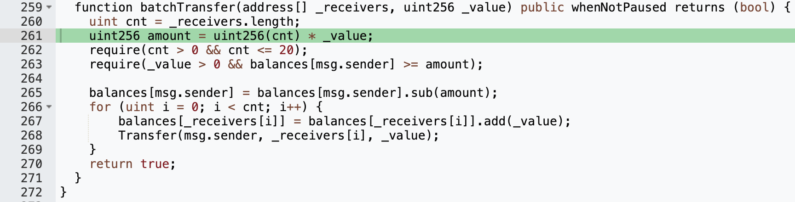

出现问题的是`PausableToken`合约的`batchTransfer`方法, 这个方法的作用是, 将`msg.sender`的代币, 平均转账给`_receivers`每个地址`_value`个, 是一个非常简单的批量转账功能.

可以看到在 261 行有一个乘法运算, 会将入参`_receivers.length`和`_value`相乘, 作为总的代币数额`amount`, 在下面也会去检查`msg.sender`是否有足够数量的代币.

如果给入参`_value`赋值`2^255`, 入参`_receivers`赋值 2 个地址, 那么由于溢出的影响, `amount = 2^255 * 2 = 0`.

这会导致什么样的结果?

1. 首先, 对`msg.sender`是否有足够数量的代币的检查会通过, 因为代币数量肯定大于等于 0.
2. `msg.sender`账户, 本来应该扣除`2^256`个代币, 但是却因为溢出, 只扣除了 0 个, 相当于代币数量没有任何变化.
3. 两个`_receivers`账户, 会各自接收到`2^255`个 bec 代币.

众所周知, 创建一个新的地址没有任何成本, 因此黑客可以创建非常多的地址, 去几乎零成本(当然还是得花点 gas 费)套取 bec 代币.

随后, 黑客将套取到的 bec 代币放到 OKEx 上交易为 BTC/ETH/USDT 等代币, 并提取到链上, 完成套现.

解决方案:

1. 在进行金额的数字运算时, 使用`SafeMath`的运算方法.
2. 使用`*`运算乘法是很自然的写法, 因此 Solidity v0.8 起, 数字运算溢出会抛出 Panic 错误.
3. BigInt 类型, 动态增加位数.

## 案例 2: Balancer V2 精度丢失攻击 (2025.11)

2025 年 11 月 3 日，老牌去中心化自动做市商协议 Balancer v2 遭到攻击，包括其 fork 协议在内的多个项目在多条链上损失约 1.2 亿美元.

这次问题的主要原因是, 计算机运算乘法或除法时, 会有精度丢失. 上面提到的数字溢出原则上不应该发生, 但是精度丢失确是不可避免的.

在讲这次攻击之前先明确几个概念.

DEX(Decentralized Exchange, 去中心化交易所): 靠链上智能合约进行资产互换, 不依赖中心化托管.

AMM(Automated Market Maker, 自动做市商): 没有订单簿，把买卖双方的对手盘换成一段数学公式，让资金池自己‘报’价格.

Composer Stable Pool: Stable 指专为价格 1:1（或固定汇率）资产设计的池子, Composer 指额外把「LP 份额代币本身」(在这里就是 BPT, Balancer Pool Token)也当成可交易资产.

BPT 的价格计算逻辑: BPT = invariant D / BPT supply.

> 合约问题代码: https://etherscan.io/address/0xdacf5fa19b1f720111609043ac67a9818262850c#code#F22#L76
> 攻击交易: https://etherscan.io/tx/0x6ed07db1a9fe5c0794d44cd36081d6a6df103fab868cdd75d581e3bd23bc9742/advanced#internal
> 取款交易: https://etherscan.io/tx/0xd155207261712c35fa3d472ed1e51bfcd816e616dd4f517fa5959836f5b48569/advanced#internal
> 用于攻击的合约 1: https://etherscan.io/address/0x54b53503c0e2173df29f8da735fbd45ee8aba30d
> 用于攻击的合约 2: https://etherscan.io/address/0x679b362b9f38be63fbd4a499413141a997eb381e

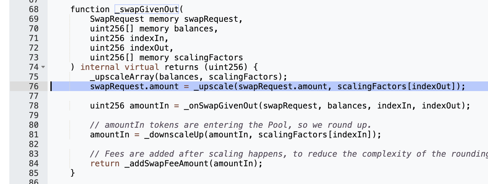
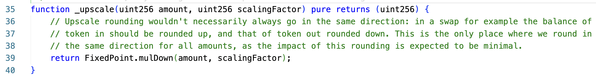

这是这次的问题代码, 在用户 Swap 时, 无论是规定了换出的金额, 还是换入的金额, 都执行了`FixedPoint.mulDown`操作, 这个操作会将两个参数相乘后除以 `1e18`.

一般情况下, 这个误差是 0.x wei (1wei = 1e-18), 相对于兑换的数目来说是一个极小的值, 比如 WETH 和 osETH 之间的大概是汇率是 1.058, 假设此时的scalingFactor 是 1058132408689971699 (约为 1.058e18):

* amount = 17e17
* scalingFactor = 1058132408689971699
* result = 1798825094772951888.3

这其中 0.3 会被舍弃, 造成的误差可以忽略不计.

但是, 如果 amount 是一个很小的值, 那么这个误差就会非常大:

* amount = 17
* scalingFactor = 1058132408689971699
* result = 17.988250947729518883

≈0.99 的数额会被舍弃, 这个舍弃的部分占 amount 的 ≈5.8%.

当然, 即使这里存在这么一点点套利空间, 但是几 wei 的数目实在是太少了, 没有利用的必要. Balancer v2 的代码注释里也提到了:

```
... as the impact of this rounding is expected to be minimal ...
```

然而别忘了, 虽然直接操作无法获取更多的利益, 但却可以使用这种方式影响 BPT 的价格. 

攻击者会首先大量使用 BPT 兑换流动性代币(如 WETH, osETH), 降低池子的流动性. 紧接着, 通过流动性代币之间的不断小额互换, 逐步放大数字精度问题造成的影响.

因为池子的流动性被人为地压得很低, 所以即使是小额的互换, 在多次不断的调用之后, 也会显著影响池子里两种代币的数量关系, 这最终导致 invariant D 显著降低, 进而显著降低 BPT 的价格.

这个时候, 攻击者就可以以明显比较低的价格, 使用流通性代币去购买 BPT. 当然, 购买完成之后, 因为池子的流动性上升, 小额数字的差值会被大额数字覆盖, invariant D会恢复正常.

下面我们从ETherscan 上实际看一下攻击者的交易记录:

攻击者地址 1 (207)部署智能合约 1 (30d), 合约 1 触发部署合约 2 (81e):

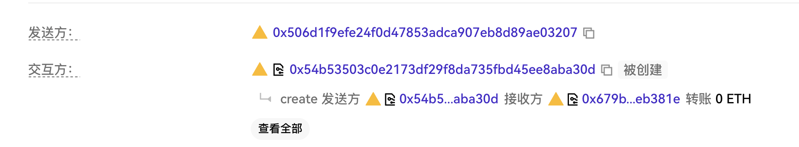

攻击者反复使用合约 1 调用 合约 2, 算出最佳的攻击金额:

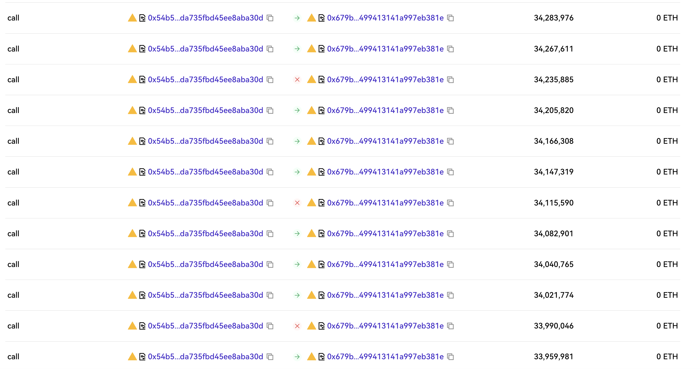

攻击者使用 Balancer 的 batchSwap 方法, 将 BPT 资产换成流通性代币:

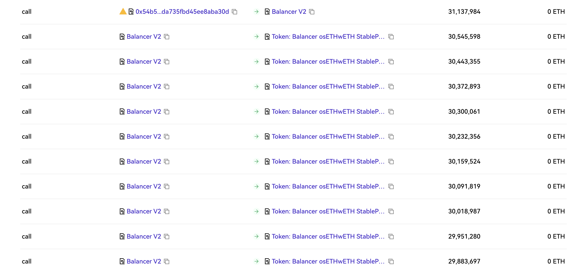

攻击者使用 Balancer 的 batchSwap 方法, 在流动性代币之间进行互换:

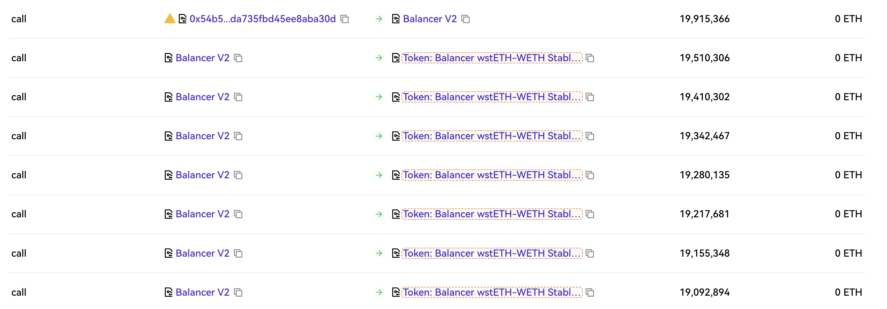

攻击者地址 1 (207)控制合约 1 (30d)将资金转移到地址 2 (e3f):

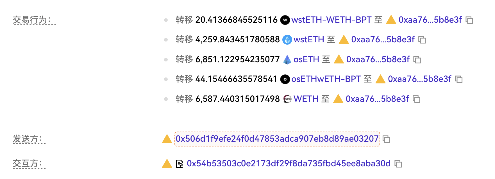

## 案例 3: The DAO 重入攻击 (2016.06)

`The DAO`创立于 2016 年 5 月, 是一个去中心化的由社区控制的投资基金, 被称为区块链上第一个DAO(去中心化自治组织). 借助于当时新兴的以太坊的智能合约能力, 很快就筹集了约 350 万的`ETH`, 当时等价约 1.5 亿美元(以现在 2025.11 的`ETH`价格看, 等价为 120 亿美元).

然而在 2016 年 6 月 17 日, 黑客利用 The DAO 智能合约的重入漏洞, 抽走约 360 万 ETH, 这些 ETH 占当时以太坊总量 14%.

涉及 ETH 数额太大, 对以太坊造成了非常大的冲击. 由于 the DAO 智能合约设计有 7 + 28 天的锁定期(到 7 月 22 日解锁), 黑客无法及时将资金转移走, 这使得攻击发生后, 以太坊社区有充足的时间进行讨论, 以对这一损失进行补救.

对以太坊链首先实行了软分叉方案: 升级以太坊软件, 收紧规则, 冻结所有和 the DAO 相关的地址的交易. 然而, 在处理这些冻结的交易时, 没有收取 gas 费, 这就导致, 任何人可以利用这一点, 零成本发布大量无效交易填充到区块中, 形成 DOS 攻击.

另外, 软分叉只是冻结了黑客盗取的资金, 并没有办法将资金退还. 最终, 在严峻的形势下, 以太坊社区只能选择了硬分叉方案: 发布一个安全的退款合约, 并规定到 1920000 个区块(7 月 20 日), 执行 the DAO 合约转移资金到该退款合约的交易, 并将这一交易认定为合法.

因为 the DAO 合约并不具备转移资金的功能, 因此正常情况下这是一笔非法交易, 但是以太坊通过软件升级后, 强制认为这一交易合法, 这是一次交易校验规则的放宽, 未升级的节点不会接受这一次交易.

一部分节点坚持区块链的不可篡改性, 并不支持硬分叉方案, 这也造成了以太坊的分裂, 形成了 ETC(经典以太坊, Ethereum Classic).

> 合约问题代码: https://etherscan.io/address/0xbb9bc244d798123fde783fcc1c72d3bb8c189413#code#L1013
> 退款合约: https://etherscan.io/address/0xbf4ed7b27f1d666546e30d74d50d173d20bca754#code
> 区块 1920000: https://etherscan.io/block/1920000

下面来看一下问题发生的原因.

这次攻击被称为重入攻击, 发生在`DAO`合约内的`splitDAO`, `withdrawRewardFor`方法, 和`ManagedAccount`合约的`payOut`方法内.

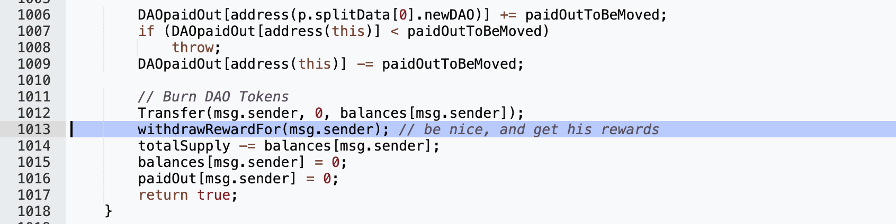
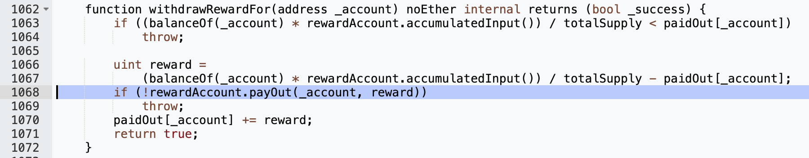
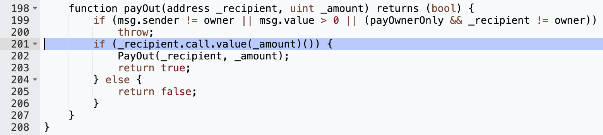

黑客会部署一个恶意合约, 调用 DAO 合约的`splitDAO`方法, 最终经由`withdrawRewardFor`和`payOut`, 最终会调用`_recipient.call.value`方法.

按照以太坊下 solidity 的执行规范, `_recipient.call.value`会调用_recipient 的 fallback 函数, 在这里也就是恶意合约的 fallback 函数.

黑客在 fallback 函数内再一次递归调用了 DAO 合约的`splitDAO`方法, 而因为`splitDAO`方法内的代码顺序是:

1. 检查余额是否足够
2. 转账
3. 操作余额

这导致递归调用`splitDAO`时余额还未扣除, 因此能够通过余额检查, 并执行了第二次的转账. 循环这个过程, 在一次又一次的递归调用下, 黑客在余额还未被扣除时, 就得到了数笔的转账.

解决方案:

1. 如果合约内部记账, 那么:
   1. 用户提资产时, 要先记账, 再实际转账
   2. 用户存资产时, 要先实际转账, 再记账
2. 如果合约存在交换(Swap), 那么:
   1. 先收取用户的资产, 再发出合约的资产

## 参考资料

https://medium.com/secbit-media/a-disastrous-vulnerability-found-in-smart-contracts-of-beautychain-bec-dbf24ddbc30e

https://www.openzeppelin.com/news/understanding-the-balancer-v2-exploit

https://www.quillaudits.com/blog/hack-analysis/the-balancer-hack

https://www.secrss.com/articles/84765

https://blog.chain.link/reentrancy-attacks-and-the-dao-hack/

https://www.bilibili.com/video/BV1Vt411X7JF
